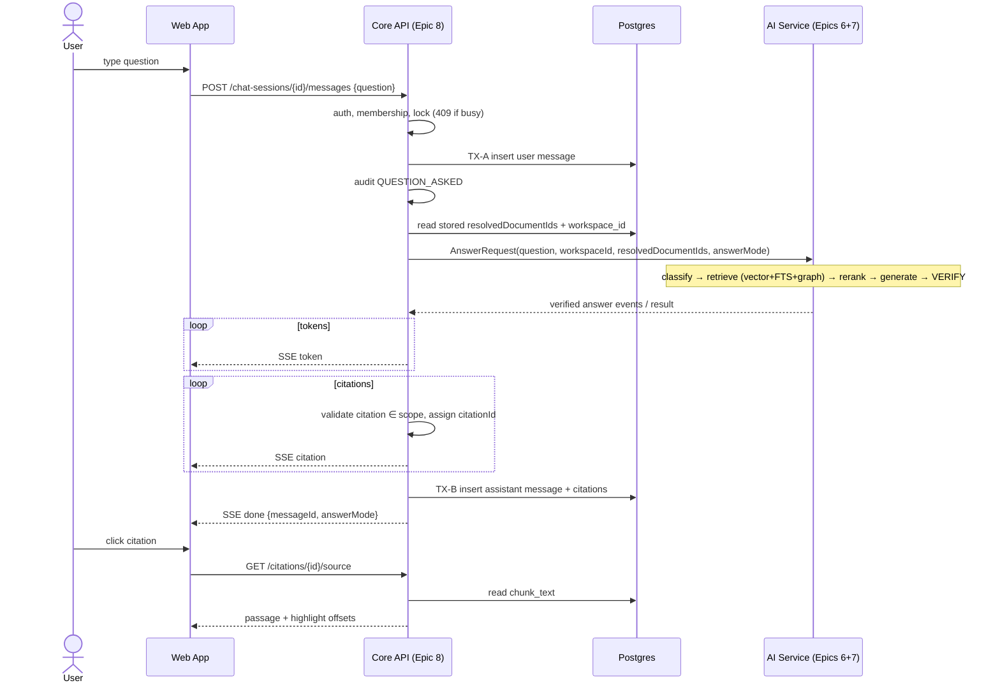

# EPIC 8 — Chat API & Citations — Implementation Plan
### Pod 3: Document Extractor + Chatbot

> **File numbering:** `00` = master plan, `01`–`11` = Epics 0–10 in order, so Epic 8 is `09_`. The master plan (`00_MASTER_SYSTEM_IMPLEMENTATION_PLAN.md`) is not part of this deliverable. Shared-component ownership below follows `06_backend_epics_and_stories.md` and `08_epic_interlinking_and_architecture_map.md`, and should be reconciled with the master plan once it exists.
>
> **Sources used:** BRD v1.1, `01_project_knowledge.md`, `02_requirements_and_user_journeys.md`, `03_architecture.md`, `04_db_mapping_and_er_diagram.md`, `06_backend_epics_and_stories.md`, `08_epic_interlinking_and_architecture_map.md`.
> **Not available:** `05_api_specs.md` and `07_realistic_timeline_and_task_plan.md` were not provided (see DG-8-01).
>
> **Markers:** `CONFLICT`, `DESIGN GAP`, `ASSUMPTION`, `OPEN QUESTION`. Nothing marked as such was invented silently.

---

## 0. PRE-FLIGHT — Read this before coding

### 0.1 Conflicts

**CONFLICT-8-01 — ERD cannot represent Story 8.1's session scope**
- Document A (`04_…` ER diagram) says: `CHAT_SESSION }o--o{ DOCUMENT "scoped to"` is many-to-many, but no join table is defined, and `CHAT_SESSION` has only `id, workspace_id, created_by, title, created_at`.
- Document B (Stories 8.1/8.5) says: a session has exactly one scope (`workspace | module | documents`), stores `moduleId`, and returns `scope` plus `resolvedDocumentIds`, fixed at creation time.
- Impact: there is nowhere to persist scope type, module, or the resolved document set. Without persistence, scope can't be immutable (8.5 AC3) or reused per message (`03_architecture.md` §4.1: "never re-derived per question").
- Recommended resolution (minimal, needs ERD owner sign-off because the ERD outranks epics in the priority order):
  - Add `chat_session.scope_type` (`WORKSPACE|MODULE|DOCUMENTS`, NOT NULL).
  - Add `chat_session.scope_module_id` (nullable FK → `document_group.id`).
  - Add join table `chat_session_document(session_id FK, document_id FK, PK(session_id, document_id))`. This materialises the M:N relationship the ERD already draws.
- Can implementation proceed? Yes, with TASK-8-01 first. Nothing else in the epic depends on this being decided differently.

**CONFLICT-8-02 — "Streaming" vs "verify before streaming"**
- Document A (Story 8.2 AC1): SSE streams incremental `token` events.
- Document B (`03_architecture.md` §4.2, `02_…` §5): claims are verified against evidence and graph *before* the answer is streamed ("Verify → Supported? → Attach citations → Stream to UI").
- Impact: tokens can only be emitted after Epic 7 finishes verification. The SSE stream is a controlled replay of a verified answer, not live LLM token passthrough. Time to first token equals full pipeline latency. This affects BRD §9's "first response within a few seconds".
- Resolution: keep the SSE contract exactly as Story 8.2 states. Epic 8 consumes an abstract event stream (`AnswerEvent`), so it works whether Epic 7 returns one verified result (Epic 8 chunks it into tokens) or streams verified segments. Never stream unverified text. Can proceed.

**CONFLICT-8-03 — Informational: table count**
- Story 0.2 says "All 17 tables"; the ER diagram defines 19 entities. Not blocking for Epic 8. It matters only if a test asserts a table count.

**CONFLICT-8-04 — Epic 9 scope wording**
- `08_…` names Epic 9 "Evaluation"; `06_…` names it "Feedback & Evaluation" and puts Story 9.1 (feedback API) in it.
- Resolution: Story 9.1 (`POST /messages/{id}/feedback`) is owned by Epic 9. Epic 8 owns only the `CHAT_MESSAGE` rows and message IDs it consumes. Epic 8 must not implement feedback.

### 0.2 Design gaps

| ID | Gap | Proposed handling |
|---|---|---|
| DG-8-01 | `05_api_specs.md` not provided. Exact JSON shapes, headers, and SSE event schemas are unconfirmed. | Shapes below are derived only from field names in Stories 8.1–8.5 and the ER diagram. Anything beyond that is marked ASSUMPTION. Reconcile with `05_…` and the published OpenAPI file before coding. |
| DG-8-02 | Audit store (Story 10.2) has no table in the ERD. | Epic 8 calls an `AuditLogger` interface owned by Epic 10 and does not create its own table. |
| DG-8-03 | Internal contract between Core API (Java) and AI Service (FastAPI) for answering is undocumented. | Epic 8 defines the consumer-side interface `AnswerGeneratorClient` (§5). The real wire format is agreed with Epic 7 before Checkpoint 2 (TASK-8-18/19). |
| DG-8-04 | How an evaluation run selects `retrieval_only` vs `retrieval_plus_graph` (BRD §8.6). | Internal method parameter on `ChatAnswerFacade`, not a public API field (ASSUMPTION A-8-05). |
| DG-8-05 | Multi-turn context. Docs say "ask follow-up" but do not say whether prior messages are sent to Epic 6/7. | Epic 8 sends only the current question and scope (matches `02_…` §5: "question + selected doc IDs"). See OQ-8-03. |
| DG-8-06 | `ANSWER_CITATION` stores no character offsets, but Story 8.4 needs highlight boundaries. | Compute offsets at read time from `source_excerpt` inside `chunk_text` (A-8-07). |
| DG-8-07 | `CHAT_MESSAGE` has no status column. Failed or aborted generations have nowhere to be recorded. | Persist the assistant message only on successful completion. The user message is always persisted. Failures go to logs and audit (A-8-06). |
| DG-8-08 | No SSE `error` event is specified. | Add one (A-8-04). |
| DG-8-09 | No endpoint to list a workspace's sessions, though the UI likely needs one. | Not implemented; would be invented. See OQ-8-05. |
| DG-8-10 | No shared error envelope or global exception handler is defined, and no owner is named. | Epic 8 uses whatever Epic 0/1 established. If none exists, TASK-8-04 defines it and flags it to the master plan. |

### 0.3 Assumptions

- **A-8-01** Naming: API "module" = `DOCUMENT_GROUP` table, and `moduleId` = `document.group_id` (per `04_…` §2).
- **A-8-02** Session scope request body is `{"scope":{"type":"workspace"|"module"|"documents","moduleId":"<uuid>","documentIds":["<uuid>",…]}}`. `title` is an optional string, since the column exists.
- **A-8-03** `resolvedDocumentIds` includes only documents in the target workspace that are not archived/soft-deleted (Story 1.4). Whether it also requires `READY` status is OQ-8-01.
- **A-8-04** SSE event names: `token`, `citation`, `done` (documented) plus `error` (added). `error` payload: `{"code":"…","message":"…"}`.
- **A-8-05** Answer mode is chosen by an internal parameter. The public message endpoint always uses `retrieval_plus_graph` and does not accept a mode field. Epic 9 calls the facade directly with either mode.
- **A-8-06** Assistant message persisted only on completed generation. If the client disconnects mid-stream, Epic 8 still consumes the upstream to completion and persists, so the audit trail and evaluation data stay consistent.
- **A-8-07** Source viewer returns highlight as `{start,end}` character offsets into the returned passage, not HTML `<mark>` tags. This avoids HTML injection from document text. Story 8.4 explicitly allows either.
- **A-8-08** The "full source passage" is the cited chunk's `chunk_text` (DOCUMENT_CHUNK is the source-faithful representation). Expanding to the whole section is OQ-8-04.
- **A-8-09** For a `isNotFound = false` answer, zero citations is an integrity failure (BRD §8.5: "every answer shall include a citation"). Not-found answers are exempt. Controlled by `chat.enforce-citations` (default `true`).
- **A-8-10** A citation whose `documentId` is outside the session's `resolvedDocumentIds` aborts the message with an `error` event and a security-level log. It is not silently dropped, because this is an isolation breach signal.
- **A-8-11** Access to a session, message, or citation is granted to any member of the owning workspace. Workspace ownership is derived server-side by joining through session → workspace, never from client-supplied IDs.
- **A-8-12** One in-flight message per session (guard via DB advisory lock or Redis lock). A second concurrent POST returns `409 MESSAGE_IN_PROGRESS`, which keeps message history ordered.
- **A-8-13** Not-found answers put the reason text in `chat_message.content` (there is no separate reason column).

### 0.4 Open questions

- **OQ-8-01** Should `resolvedDocumentIds` exclude documents not yet `READY`, and should an empty resolved scope be rejected? Recommended: include only `READY` documents; reject an empty scope with `422 EMPTY_SCOPE`.
- **OQ-8-02** If a document in a session's stored scope is archived after session creation, should the message fail, or should retrieval simply exclude it? Recommended: re-filter archived IDs at message time; if none remain return `409 SCOPE_EMPTY`.
- **OQ-8-03** Should follow-up questions carry prior turns to Epic 6 for query rewriting? Default here: no.
- **OQ-8-04** Should the source viewer return the chunk or the enclosing section?
- **OQ-8-05** Do we need `GET /workspaces/{id}/chat-sessions` (list)? Not in any story.
- **OQ-8-06** Are chat sessions private to the creator or shared workspace-wide? A-8-11 chooses workspace-wide.
- **OQ-8-07** Can sessions be created or messages posted in an archived workspace (Story 1.1 has archive)? Recommended: no, `409`.

---

## 1. EPIC OVERVIEW

| Field | Value |
|---|---|
| **Epic ID** | 8 |
| **Epic name** | Chat API & Citations |
| **Owner** | Junior Dev 3 (`06_…`, `08_…`) |
| **Estimate** | 4.5 dev-days (8.1: 1.0, 8.2: 1.5, 8.3: 1.0, 8.4: 0.5, 8.5: 0.5) |
| **Priority** | All five stories P0 |
| **Layer** | Core API (Java 21 / Spring Boot 3). Chat Sessions component in `03_architecture.md` §2. |

**Business objective.** Let a user ask a plain-language question against a chosen scope (whole workspace, one module, or specific documents) and receive a streamed, verified, cited answer. The user can click any citation and see the exact source passage. This is the user-facing half of POC exit criterion 2 (live demo) and the delivery channel for criterion 1 (accuracy evidence is generated through this pipeline).

**Business problem.** General AI chat tools hallucinate and lose track of which document a fact came from (BRD §2). Epic 8 is where "grounded and cited" becomes visible: every answer carries a persisted, retrievable citation trail, and the scope the user chose is enforced as a hard boundary.

**What Epic 8 is, in the architecture map (`08_…` §3).** Epic 8 owns both ends of the query flow and none of the middle:
- **Start (EP8a):** session creation → scope resolution → `resolvedDocumentIds + workspace_id`.
- **End (EP8b):** SSE streaming → citation storage → source passage viewer.
- **Middle (Epics 6 and 7):** retrieval, generation, verification, all in the AI Service. Epic 8 treats it as a black box behind `AnswerGeneratorClient`.

**Scope (in).**
- Session create/get with scoped creation and server-side scope resolution.
- Message endpoint with SSE streaming (`token`, `citation`, `done`) against a stub generator first, then the real Epic 7 generator.
- Citation persistence and retrieval.
- Source passage viewer.
- Cross-workspace rejection at session creation.
- Programmatic answer facade for Epic 9.

**Out of scope.**
- Retrieval, reranking, graph queries (Epic 6).
- Answer generation, claim verification, not-found decision (Epic 7).
- Feedback API (Story 9.1, Epic 9).
- Evaluation harness (Epic 9).
- Audit table and logging framework (Epic 10). Epic 8 only emits to them.
- Auth, workspace and module CRUD (Epics 0/1).
- Session listing (DG-8-09).
- Frontend.

**Actors.** Business User (asks, clicks citations); QA/Evaluator (via Epic 9, programmatic path); Core API; AI Service (Epic 7 output); FE (consumer of the frozen contract).

**Dependencies.** Upstream: Epic 0 (schema, auth), Epic 1 (Stories 1.1, 1.5: workspace and module data), Epic 7 (real generator, at Checkpoint 2), Epic 2 (`DOCUMENT_CHUNK` rows for the source viewer). Downstream: Epic 9 (9.1 needs `CHAT_MESSAGE`; 9.3 calls the facade), Epic 10 (10.2 needs the 8.2 hook). Details in §11.

---

## 2. REQUIREMENT TRACEABILITY

| BRD / Journey requirement | Epic | Story | AC | Component | Implementation |
|---|---|---|---|---|---|
| BRD §8.1 last bullet — select workspace / module / documents before asking; Doc 02 §2.1 | 8 | 8.1 | AC1, AC2 | `ChatSessionController`, `ChatSessionService` | Scoped session create; get returns scope |
| BRD §8.1 / §8.3 / §9 — workspace isolation, "mandatory" | 8 | 8.5 | AC1, AC2, AC3 | `ScopeResolver`, `ChatSessionService` | Server-side resolve, reject cross-workspace, immutable scope |
| BRD §8.4 — answer only from selected scope | 8 | 8.1, 8.5, 8.2 | 8.1 AC2, 8.5 AC1, 8.2 AC1 | `ChatMessageService` | Hard-filter IDs from the *stored* session scope forwarded to AI Service |
| BRD §8.4 — plain-language question; "not found" rather than guess | 8 | 8.2 | AC1 | `ChatMessageService`, `AnswerEventMapper` | Forward question; relay Epic 7's `isNotFound` |
| BRD §8.4 — comparison questions keep facts attributed | 8 | 8.2, 8.3 | 8.2 AC1, 8.3 AC1 | `ChatMessageService`, `CitationService` | Multiple citations per answer with distinct `documentId` |
| BRD §8.5 — every answer cites document/page/section | 8 | 8.3 | AC1, AC2 | `CitationService`, `CitationController` | Persist `documentId, page, section, excerpt`; `GET /messages/{id}/citations` |
| BRD §8.5 — view exact source passage; Doc 02 §2.5 | 8 | 8.4 | AC1 | `SourcePassageService`, `CitationController` | `GET /citations/{id}/source` |
| BRD §8.6 — record retrieval-only vs +graph | 8 | 8.2 | AC1 (`answerMode` in `done`) | `ChatAnswerFacade`, `ChatMessage.answer_mode` | Persist and emit `answerMode` |
| BRD §9 Performance — first response within a few seconds | 8 | 8.2 | AC1 | SSE infra | Non-blocking SSE; see CONFLICT-8-02 |
| BRD §9 Auditability | 8 (with 10) | 8.2 → 10.2 | 10.2 AC1 | `AuditLogger` call site | `QUESTION_ASKED` audit event |
| BRD §9 Reliability — complete a demo run | 8 | 8.2 | AC2 | `StubAnswerGenerator`, error handling | Stub-first build; explicit error event |
| Doc 08 §1 — build against stub, swap at Checkpoint 2 | 8 | 8.2 | AC2 | `AnswerGeneratorClient` (adapter) | Stub and HTTP implementations behind one config value |

**AC coverage:** 8.1 (2), 8.2 (2), 8.3 (2), 8.4 (1), 8.5 (3) = 10 ACs, all mapped in §3 and tested in §19.

---

## 3. STORY-BY-STORY IMPLEMENTATION PLAN

### Story 8.1 — Chat session management with scoped creation
*Est 1.0d · P0 · Depends on 1.1 (and 8.5 for the resolution logic it calls)*

**Business requirement.** A user picks what a conversation is "about" (workspace, module, or specific documents) before asking anything.

**Acceptance criteria (verbatim).**
- **AC1.** `POST /workspaces/{id}/chat-sessions` accepts exactly one scope: `workspace`, `module` (`moduleId`), or `documents` (`documentIds`).
- **AC2.** `GET /chat-sessions/{id}` returns full message history plus the resolved scope.
- *Sample action:* create a session with `{"scope": {"type": "module", "moduleId": "uuid"}}`, then fetch it. *Expected:* session returned with `scope.type: "module"` and the correct `resolvedDocumentIds` for that module.

**Technical interpretation.**
- AC1: request validation enforces a discriminated union. `type=workspace` forbids `moduleId`/`documentIds`. `type=module` requires `moduleId` and forbids `documentIds`. `type=documents` requires a non-empty `documentIds` and forbids `moduleId`. Any other combination is `400 INVALID_SCOPE` (A-8-02).
- AC2: GET assembles the session row, its scope, the resolved IDs from `chat_session_document`, and messages ordered by `created_at ASC`.

**Implementation.**
1. Controller validates the DTO and calls `ChatSessionService.createSession(workspaceId, userId, request)`.
2. The service checks workspace membership, calls `ScopeResolver` (Story 8.5), and persists the session and its document rows in one transaction.
3. It returns `201` with the session DTO.
4. GET loads the session, verifies workspace membership via session → workspace, and returns the DTO plus messages.

**Components.** `ChatSessionController`, `ChatSessionService`, `ScopeResolver` (8.5), `ChatSessionRepository`, `ChatSessionDocumentRepository`, `ChatMessageRepository` (read), `WorkspaceAccessGuard` (from Epic 0/1, reused), DTOs `CreateChatSessionRequest`, `ChatSessionResponse`, `ChatMessageDto`.

**Database.**
- INSERT `chat_session(id, workspace_id, created_by, title, created_at, scope_type, scope_module_id)` (the last two require CONFLICT-8-01's migration).
- INSERT `chat_session_document(session_id, document_id)` × N.
- READ `chat_message` by `session_id`, `workspace`/`document_group`/`document` for resolution.
- No update or delete of sessions in this epic. Single transaction for create.

**APIs.**
- `POST /workspaces/{workspaceId}/chat-sessions`. Body per A-8-02. Success `201`:
  ```json
  { "id":"uuid", "workspaceId":"uuid", "title":null,
    "scope":{"type":"module","moduleId":"uuid"},
    "resolvedDocumentIds":["uuid","…"], "createdAt":"…" }
  ```
  (ASSUMPTION: field set = ER columns + fields named in the story; confirm with `05_…`.)
- `GET /chat-sessions/{sessionId}`. Success `200`: same object plus `messages:[{id, role, content, answerMode, confidence, isNotFound, createdAt}]`.
- Errors: `400 INVALID_SCOPE`, `400 SCOPE_OUTSIDE_WORKSPACE` (8.5), `401`, `403`, `404 SESSION_NOT_FOUND` / `WORKSPACE_NOT_FOUND`, `422 EMPTY_SCOPE` (pending OQ-8-01).

**Events.** None (no broker events exist in this system's design). Audit hook: see Story 8.2's note on whether session creation is audited (not required by 10.2; not added).

**Business rules.** BR-8-01, BR-8-02, BR-8-03, BR-8-04, BR-8-11.

**Validation.**
- Required: `scope.type`.
- Format: UUIDs well-formed; `documentIds` de-duplicated; a sane max size (config `chat.scope.max-documents`, ASSUMPTION).
- State: workspace exists and (OQ-8-07) is active.
- Cross-entity: 8.5.

**Error handling.** Malformed body → 400. Workspace not visible to caller → 403 (per Story 0.4 AC3). Concurrent duplicate create is harmless (two sessions).

**Security.** Bearer token required. Caller must be a workspace member. GET requires membership in the session's workspace, resolved server-side.

**Audit/logging.** INFO log with `requestId, workspaceId, scopeType, resolvedCount`. No audit event required by 10.2.

**Testing.** T-8.1-a…f in §19.

---

### Story 8.2 — Chat message endpoint with SSE streaming
*Est 1.5d · P0 · Built against a stub answer generator first; wired to Epic 7 at Checkpoint 2 (Day 8)*

**Business requirement.** Ask a question and watch a grounded, cited answer arrive.

**Acceptance criteria (verbatim).**
- **AC1.** `POST /chat-sessions/{id}/messages` streams tokens, citations, and a final `done` event via SSE.
- **AC2.** Works end-to-end with a stubbed answer generator before Epic 7 is ready.
- *Sample action:* send a question and observe the SSE stream. *Expected:* client receives incremental `token` events, one or more `citation` events, and a final `done` event with `messageId` and `answerMode`.

**Technical interpretation.**
- AC1: response `Content-Type: text/event-stream`. Event order is `token*` → `citation*` → `done`. Interleaving citations between tokens is permitted; `done` is always last (BR-8-06). Because of CONFLICT-8-02, the tokens are a chunked replay of the verified answer.
- AC2: `AnswerGeneratorClient` is an adapter. `StubAnswerGenerator` is the default implementation until Checkpoint 2, selected by a single config value (BR/`06_…` §1 rule 3).

**Implementation.**
1. Validate the request body `{ "question": "…" }` (non-blank, max length via config).
2. Load the session; verify workspace membership; acquire the per-session lock (A-8-12).
3. Persist the user message (its own transaction, so it survives failures).
4. Emit audit `QUESTION_ASKED` via `AuditLogger` (Epic 10).
5. Build `AnswerRequest{question, sessionId, workspaceId, resolvedDocumentIds (from chat_session_document), answerMode}`. **Scope is read only from the stored session, never from the request body** (BR-8-05).
6. Open the SSE emitter, call `AnswerGeneratorClient.generate(request)`, and consume events:
   - `TOKEN(text)` → append to a buffer, emit `token`.
   - `CITATION(documentId, chunkId, page, section, excerpt)` → validate (BR-8-08), assign `citationId = UUID`, buffer, emit `citation`.
   - `FINAL(isNotFound, confidence, answerMode)` → go to step 7.
7. Validate the citation policy (BR-8-09). In one transaction insert the assistant `chat_message` (`content` = joined tokens, `answer_mode`, `confidence`, `is_not_found`) plus all `answer_citation` rows. Then emit `done{messageId, answerMode, isNotFound, confidence}` (extra fields: A-8-04) and complete the emitter.
8. On any failure → emit `error`, release the lock, log, audit failure. No assistant message is persisted.
9. The same core logic is exposed as `ChatAnswerFacade.ask(sessionId, question, answerMode)` returning `AnswerOutcome{messageId, content, citations, isNotFound, confidence, answerMode}`. The SSE controller is a thin streaming wrapper over it, so Epic 9 exercises identical code.

**Components.** `ChatMessageController`, `ChatMessageService`, `ChatAnswerFacade`, `AnswerGeneratorClient` (interface), `StubAnswerGenerator`, `HttpAnswerGenerator` (Checkpoint 2), `SseStreamWriter`, `SessionLockManager`, `CitationService` (8.3), `AuditLogger` (Epic 10 interface), DTOs `PostMessageRequest`, `AnswerRequest`, `AnswerEvent`.

**Database.**
- INSERT `chat_message` (user): `role='user', content, session_id, created_at`.
- READ `chat_session`, `chat_session_document`.
- INSERT `chat_message` (assistant): `role='assistant', content, answer_mode, confidence, is_not_found`.
- INSERT `answer_citation` × N (8.3).
- Transactions: TX-A (user message), TX-B (assistant message + citations, atomic). No DB transaction is held open while streaming.

**APIs.** `POST /chat-sessions/{sessionId}/messages`, Body `{"question":"…"}`. Response: SSE stream. Example wire shape (ASSUMPTION, derived from the story):
```
event: token
data: {"text":"The notice period is "}

event: citation
data: {"citationId":"uuid","documentId":"uuid","page":4,"section":"Termination","excerpt":"…"}

event: done
data: {"messageId":"uuid","answerMode":"retrieval_plus_graph","isNotFound":false,"confidence":0.92}
```
Errors before the stream opens (normal JSON): `400 VALIDATION_ERROR`, `401`, `403`, `404 SESSION_NOT_FOUND`, `409 MESSAGE_IN_PROGRESS`. Errors after the stream opens: SSE `error` event.

**Events.** SSE events only (see the message definitions above). No broker events.

**Business rules.** BR-8-05, BR-8-06, BR-8-07, BR-8-08, BR-8-09, BR-8-10, BR-8-11, BR-8-12, BR-8-13.

**Validation.** Required `question`; length limits (config); session exists; caller is a member; the session has non-empty scope; no in-flight message.

**Error handling.** See §16. Notable cases: upstream timeout, upstream error, malformed event, citation out of scope, missing citations, client disconnect, persistence failure at TX-B (emit `error`, do not send `done`).

**Security.** Auth and membership as above. The stream carries only data from the session's resolved scope (guaranteed upstream by Epics 6/7 and re-checked by BR-8-08).

**Audit/logging.** Audit `QUESTION_ASKED` (user, timestamp, sessionId, workspaceId). Structured log per stream: `requestId, sessionId, answerMode, durationMs, tokenCount, citationCount, outcome`. Never log question or answer text at INFO (may contain document content; POC data-sensitivity is still open).

**Testing.** T-8.2-a…j in §19.

---

### Story 8.3 — Citation storage & retrieval
*Est 1.0d · P0 · Depends on 8.2*

**Business requirement.** Every answer's evidence trail must survive after the stream ends and be exactly what the user saw.

**Acceptance criteria (verbatim).**
- **AC1.** Every citation on an answer is persisted with `documentId`, `page`, `section`, `excerpt`.
- **AC2.** `GET /messages/{id}/citations` returns them.
- *Sample action:* fetch citations for a previously answered message. *Expected:* returns the exact citations shown during the original SSE stream, unchanged.

**Technical interpretation.**
- AC1 maps to `answer_citation(document_id, page_number, section_heading, source_excerpt)` plus `chunk_id` (needed by 8.4) and `message_id`.
- "Exact citations… unchanged" implies the same IDs, same order, and same values. Hence the `citationId` assigned at stream time is the persisted PK, and citations carry a stable ordering (see below).

**Implementation.**
- `CitationService.validateAndBuffer(sessionScope, citationEvent)`: checks the document is in `resolvedDocumentIds`, and that the chunk exists and belongs to that document (BR-8-08). Assigns the UUID.
- `CitationService.persistAll(messageId, bufferedCitations)`: called inside TX-B.
- `GET /messages/{messageId}/citations`: resolve message → session → workspace, check membership, return citations in original emission order.
- ORDER: the ER diagram has no sequence column. **DESIGN GAP:** stable ordering needs one. Minimal option: add `answer_citation.ordinal int`, in the same migration as CONFLICT-8-01. Fallback: order by `id` with UUIDv7 (time-ordered). Recommended: add `ordinal`.

**Components.** `CitationService`, `AnswerCitationRepository`, `CitationController` (shared with 8.4), `DocumentChunkRepository` (read-only, Epic 2's table), DTO `CitationDto{citationId, documentId, page, section, excerpt}`.

**Database.**
- INSERT `answer_citation(id, message_id, document_id, chunk_id, page_number, section_heading, source_excerpt[, ordinal])`.
- READ `answer_citation` by `message_id`; READ `document_chunk` (id, document_id) for validation; READ `chat_message → chat_session` for workspace resolution.
- Constraints: FK to `chat_message`, `document`, `document_chunk`; index on `answer_citation(message_id)` (proposed, since none is listed in §4 of the DB doc).

**APIs.** `GET /messages/{messageId}/citations` → `200 [{citationId, documentId, page, section, excerpt}, …]` (ASSUMPTION: shape mirrors the SSE `citation` payload so the FE can reuse one type). `404 MESSAGE_NOT_FOUND`, `401`, `403`. For not-found answers: `200 []`.

**Events.** SSE `citation` (produced in 8.2).

**Business rules.** BR-8-07, BR-8-08, BR-8-09, BR-8-13.

**Validation.** Cited `documentId ∈ resolvedDocumentIds`; `chunkId` exists and `chunk.document_id == documentId`; `page ≥ 1`; excerpt non-empty. A whitespace-normalised excerpt should be a substring of `chunk_text`. If not, WARN plus a metric, still persisted (the source viewer then returns no highlight, per §7).

**Error handling.** Invalid citation → abort the message (A-8-10). Persistence failure → rollback TX-B (no message and no partial citations).

**Security.** The workspace is derived from the message's session. A member of another workspace gets `403`.

**Audit/logging.** DEBUG log per persisted citation; WARN on excerpt mismatch; ERROR on out-of-scope citation (include `sessionId, documentId`, not the excerpt).

**Testing.** T-8.3-a…e.

---

### Story 8.4 — Source passage viewer
*Est 0.5d · P0 · Depends on 8.3*

**Business requirement.** One click from a citation to the passage it came from.

**Acceptance criteria (verbatim).**
- **AC1.** `GET /citations/{id}/source` returns the full source passage with the cited excerpt highlighted/marked.
- *Sample action:* open a citation's source. *Expected:* response includes the full paragraph/section text with the cited excerpt clearly delimited (e.g. `<mark>` boundaries or offset indices).

**Technical interpretation.** Read the cited chunk's `chunk_text` (source-faithful text, per architecture principle 3; never an LLM summary). Locate the excerpt inside it and return offsets (A-8-07, A-8-08).

**Implementation.**
1. Load the citation → message → session → workspace; check membership.
2. Load the chunk by `citation.chunk_id`; verify `chunk.document_id == citation.document_id` (integrity).
3. Compute `start/end` by exact substring match. If that fails, retry on whitespace-normalised text, mapping back to original offsets. If both fail, `highlight: null`.
4. Return the passage plus metadata.

**Components.** `SourcePassageService`, `HighlightLocator` (pure function; heavily unit-tested), `CitationController.getSource`, DTO `SourcePassageDto`.

**Database.** READ `answer_citation`, `document_chunk` (chunk_text, page_number, section_id), `document_section` (heading, optional), `document` (file_name, workspace_id), and `chat_message`/`chat_session` for authorization. No writes.

**APIs.** `GET /citations/{citationId}/source` → `200`:
```json
{ "citationId":"uuid","documentId":"uuid","fileName":"…","page":4,"section":"Termination",
  "passage":"…full chunk_text…","highlight":{"start":120,"end":214}}
```
(`highlight` may be `null`. Field names other than those in the story are ASSUMPTION.) Errors: `404 CITATION_NOT_FOUND`, `401`, `403`, `404 SOURCE_UNAVAILABLE` if the chunk was deleted (e.g. document reprocessed).

**Events.** None.

**Business rules.** BR-8-13, BR-8-14 (passage text is returned as plain text, never HTML).

**Validation.** Path UUID well-formed; `start < end ≤ len(passage)`.

**Error handling.** Chunk missing → `404 SOURCE_UNAVAILABLE`. Highlight not locatable → `200` with `highlight:null` plus a WARN log. This is not an error to the user, but it is tracked as a data-quality signal for Epic 7.

**Security.** As 8.3. The passage is document content, so access is strictly workspace-membership scoped.

**Audit/logging.** INFO `requestId, citationId`; no passage text in logs.

**Testing.** T-8.4-a…d.

---

### Story 8.5 — Scope resolution & cross-workspace rejection
*Est 0.5d · P0 · Depends on 8.1, 1.5*

**Business requirement.** Workspace isolation is a correctness guarantee (BRD §8.3/§9, `01_…` decision 14). A session can never be scoped to anything outside its workspace, and scope can't drift mid-conversation.

**Acceptance criteria (verbatim).**
- **AC1.** `module`/`documents` scope is resolved server-side to a concrete `documentIds` list at session-creation time, before any question is asked.
- **AC2.** A `moduleId` or `documentId` that doesn't belong to the request's `{workspaceId}` is rejected with `400 SCOPE_OUTSIDE_WORKSPACE` at creation time — never silently dropped or partially honored.
- **AC3.** The resolved scope, once set, cannot be changed mid-session.
- *Sample action:* attempt to create a session in Workspace A referencing a `documentId` that actually belongs to Workspace B. *Expected:* `400 SCOPE_OUTSIDE_WORKSPACE`; no session is created.

**Technical interpretation.**
- AC1: `ScopeResolver` implements `03_architecture.md` §4.1 exactly. `workspace` → all in-workspace documents; `module` → documents with `group_id = moduleId` (module must belong to the workspace); `documents` → the given IDs, each validated to belong to the workspace. The output is `resolvedDocumentIds + workspaceId`.
- AC2: validate by querying `WHERE workspace_id = :pathWorkspaceId AND id IN (:ids)`. If `count != distinct(ids).size` → reject the whole request. No partial creation, and the error body must not reveal whether the foreign ID exists in another workspace (return no detail).
- AC3: no update endpoint exists. The service exposes no scope mutator, and the `chat_session_document` rows are insert-only.

**Implementation.**
- `ScopeResolver.resolve(workspaceId, ScopeRequest) → ResolvedScope`. Pure logic plus repository reads.
- The whole create runs in one transaction; any rejection happens before any INSERT.
- Immutability: no `PUT/PATCH` for `/chat-sessions/{id}`. Repositories for `chat_session_document` don't expose update/delete. Add a DB-level guard if cheap (e.g. revoke UPDATE/DELETE, or a trigger), otherwise enforce in code and test (TASK-8-06).
- Message posting reads the stored resolved IDs, never the request body.

**Components.** `ScopeResolver`, `ResolvedScope` (value object), `ScopeOutsideWorkspaceException`, `DocumentRepository.findIdsByWorkspaceAndIdIn` / `findIdsByWorkspaceAndGroup`, `DocumentGroupRepository.existsByIdAndWorkspace` (Epic 1.5's repositories, reused, not re-implemented).

**Database.** READ `document(id, workspace_id, group_id, processing_status, archived)`, `document_group(id, workspace_id)`. Writes only through 8.1. Indexes used: `document.workspace_id`, `document.group_id` (exist per DB doc §4).

**APIs.** Behaviour of `POST /workspaces/{id}/chat-sessions` (8.1). Error `400 SCOPE_OUTSIDE_WORKSPACE`. Also `400 INVALID_SCOPE` (shape), `422 EMPTY_SCOPE` (OQ-8-01).

**Events.** None.

**Business rules.** BR-8-02, BR-8-03, BR-8-04, BR-8-05.

**Validation.** Every `documentId` and `moduleId` ∈ path workspace. `documentIds` distinct. Module must exist.

**Error handling.** Foreign or nonexistent IDs return the same `400 SCOPE_OUTSIDE_WORKSPACE`, to avoid an existence oracle. No session or scope rows are written.

**Security.** This story is the isolation enforcement point at the Core API. Defence in depth: BR-8-08 re-checks every citation, and Epics 6/7 receive `workspace_id` as a hard filter.

**Audit/logging.** WARN on rejected cross-workspace attempts with `userId, workspaceId, offendingIdCount`, not the IDs' content.

**Testing.** T-8.5-a…e, plus the explicit isolation suite (§19.9).

---

## 4. END-TO-END FLOW

### 4.1 Session creation
```
FE → POST /workspaces/{wsId}/chat-sessions
  → Auth filter (401) → WorkspaceAccessGuard (403)
  → Validation (400 INVALID_SCOPE)
  → ChatSessionService.createSession
      → ScopeResolver (workspace-bounded reads; 400 SCOPE_OUTSIDE_WORKSPACE)
      → TX: INSERT chat_session + chat_session_document rows
  → 201 {session, scope, resolvedDocumentIds}
```

### 4.2 Question → streamed, cited answer


### 4.3 Failure and edge paths

| Path | Behaviour |
|---|---|
| Validation failure | `400` JSON before the stream opens |
| Not found | `404 SESSION_NOT_FOUND` / `MESSAGE_NOT_FOUND` / `CITATION_NOT_FOUND` |
| Unauthorized | `401` no/invalid token; `403` non-member |
| Duplicate / concurrent | Second in-flight POST → `409 MESSAGE_IN_PROGRESS` |
| Business "not found" answer | Normal stream: tokens carry the reason, no citations, `done{isNotFound:true}` |
| External failure (AI Service 5xx / connection) | `error` SSE event (`UPSTREAM_FAILURE`); user message kept; no assistant message |
| Timeout | `error` event `UPSTREAM_TIMEOUT` after `chat.upstream.timeout-ms`; cancel the upstream call |
| Retry | No automatic retry of generation (side effects: audit, cost). The client re-posts. Idempotency-Key not documented (not added) |
| Rollback | TX-B rollback → no message and no citations; emit `error` `PERSISTENCE_FAILURE` |
| Partial failure | Tokens already sent, then failure → `error` event; the FE must discard the partial bubble (documented in the FE contract note) |
| Client disconnect | Continue upstream, persist (A-8-06), release the lock |

---

## 5. ARCHITECTURE MAPPING

Epic 8 lives in **Core API → Chat Sessions** (`03_architecture.md` §2), calling the **AI Service** through the "AI Orchestration" boundary. Nothing here redesigns the architecture. The Epic-8-specific decision is only the adapter interface.

| Component | Responsibility | Input | Output | Dependencies | Business logic | DB | External |
|---|---|---|---|---|---|---|---|
| `ChatSessionController` | HTTP for sessions | REST | DTOs | `ChatSessionService` | none | — | — |
| `ChatSessionService` | Create/get session | request, userId | session | `ScopeResolver`, repos, guard | scope shape, membership | RW `chat_session*` | — |
| `ScopeResolver` | Resolve scope → IDs | workspaceId, ScopeRequest | `ResolvedScope` | Doc/Module repos | BR-8-02..04 | R `document`, `document_group` | — |
| `ChatMessageController` | POST messages (SSE) | question | SSE | `ChatMessageService` | none | — | — |
| `ChatMessageService` | Orchestrate a turn | sessionId, question | events | client, `CitationService`, audit, lock | BR-8-05..13 | RW `chat_message`, R session | AI Service via client |
| `ChatAnswerFacade` | Programmatic entry (Epic 9) | sessionId, question, mode | `AnswerOutcome` | `ChatMessageService` | same rules | same | same |
| `AnswerGeneratorClient` | Adapter to Epic 6+7 | `AnswerRequest` | `AnswerEvent` stream | — | none | — | Stub / HTTP |
| `CitationService` | Validate/persist citations | events, scope | rows | chunk repo | BR-8-08/09 | RW `answer_citation`, R chunk | — |
| `CitationController` | Citations + source endpoints | ids | DTOs | services | none | — | — |
| `SourcePassageService` + `HighlightLocator` | Build source view | citationId | passage + offsets | repos | BR-8-14 | R chunk, section, doc | — |
| `SessionLockManager` | One in-flight message per session | sessionId | lock | Redis or DB advisory lock | A-8-12 | — | Redis (optional) |

**Internal contract to Epic 7 (Design gap DG-8-03; consumer side):**
```
AnswerRequest  { question, sessionId, workspaceId, resolvedDocumentIds[], answerMode }
AnswerEvent    = TOKEN{text} | CITATION{documentId, chunkId, page, section, excerpt}
               | FINAL{isNotFound, confidence, answerMode}
```
Requirements Epic 8 places on Epic 7's output:
- `chunkId` and `documentId` on every citation.
- `excerpt` is a verbatim substring of the chunk text.
- `isNotFound=true` implies zero citations.
- `answerMode` echoes the request.

---

## 6. DATABASE IMPLEMENTATION

The ERD is the source of truth. Additions are limited to CONFLICT-8-01 and the ordering gap.

| Entity / Table | Purpose | PK | FKs | Relevant columns | Constraints / Indexes | Audit fields |
|---|---|---|---|---|---|---|
| `chat_session` | A conversation with fixed scope | `id` | `workspace_id`→workspace, `created_by`→user_account, **`scope_module_id`→document_group (new, nullable)** | `title`, `created_at`, **`scope_type` (new)** | B-tree `workspace_id` (exists). CHECK: `scope_type='MODULE'` ⇒ `scope_module_id IS NOT NULL`; else NULL | `created_by`, `created_at` |
| **`chat_session_document` (new; realises the ERD's M:N)** | Resolved scope snapshot | `(session_id, document_id)` | `session_id`→chat_session, `document_id`→document | — | Index on `document_id`; insert-only | — |
| `chat_message` | User and assistant turns | `id` | `session_id`→chat_session | `role`, `content`, `answer_mode`, `confidence`, `is_not_found`, `created_at` | Index `(session_id, created_at)` (proposed) | `created_at` |
| `answer_citation` | Evidence for an assistant message | `id` (assigned at stream time) | `message_id`, `document_id`, `chunk_id` | `page_number`, `section_heading`, `source_excerpt`, **`ordinal` (new, recommended)** | Index `message_id` (proposed) | — |
| `document_chunk` (Epic 2, read-only) | Source passage | `id` | `document_id`, `section_id` | `chunk_text`, `page_number` | — | — |
| `document`, `document_group`, `workspace`, `workspace_member` (Epics 1/0, read-only) | Scope validation and authz | — | — | `workspace_id`, `group_id`, `processing_status` | — | — |

Cardinality: workspace 1—N session; session 1—N message; message 1—N citation; session N—M document (via join table); citation N—1 chunk.

**Operations.**

| Op | Table | Fields | Preconditions | Validation | Transaction | Failure |
|---|---|---|---|---|---|---|
| CREATE session | `chat_session`, `chat_session_document` | all | Scope resolved and valid | 8.5 | single TX | Rollback; no rows |
| CREATE user message | `chat_message` | role, content, session_id | Session exists, membership OK, lock held | question non-blank | TX-A | 500; lock released |
| CREATE assistant message + citations | `chat_message`, `answer_citation` | see above | Final event received; citations valid | BR-8-08/09 | TX-B (atomic) | Rollback; `error` event |
| READ session/messages | `chat_session`, `chat_message`, `chat_session_document` | — | Membership | — | read-only | 404/403 |
| READ citations | `answer_citation` | — | Membership via message→session | — | read-only | 404/403 |
| READ source | `answer_citation`, `document_chunk`, `document` | — | Membership | integrity check | read-only | 404 |
| UPDATE | none in this epic | | | | | |
| DELETE | none in this epic (session/message deletion is not in any story) | | | | | |

Migration ownership: Epic 0's baseline migration (Story 0.2) creates the ERD tables. The Epic 8 delta (scope columns, join table, `ordinal`, indexes) goes in a **separate, later Flyway migration** owned by Epic 8, after sign-off on CONFLICT-8-01.

---

## 7. API IMPLEMENTATION

Common to all: caller = FE (and Epic 9 internally for the facade); auth = bearer token (Story 0.4); authz = workspace membership resolved server-side; logging = structured JSON with `requestId` (Story 10.1); timeouts per §21. JSON bodies use camelCase. Field shapes beyond those named in `06_…` are ASSUMPTIONS (DG-8-01).

### POST /workspaces/{workspaceId}/chat-sessions
- **Purpose:** create a scoped session. **Path:** `workspaceId`. **Body:** `{scope, title?}` (A-8-02).
- **Validation:** shape (discriminated union), UUID format, ID counts. **Business validation:** all referenced IDs ∈ workspace (BR-8-03); non-empty resolved set (OQ-8-01).
- **Processing:** §3 Story 8.1/8.5. **DB:** §6. **Downstream calls:** none. **Events:** none.
- **Response:** `201` session object. **Errors:** 400 `INVALID_SCOPE` / `SCOPE_OUTSIDE_WORKSPACE`, 401, 403, 404, 422 `EMPTY_SCOPE`.
- **Audit:** none required. **Idempotency:** not idempotent (each call creates a session). **Retry:** safe but creates duplicates. **Timeout:** default request timeout.

### GET /chat-sessions/{sessionId}
- **Purpose:** session + resolved scope + full message history. **Authz:** membership of the session's workspace.
- **Response:** `200` (see Story 8.1). **Errors:** 401, 403, 404. **Idempotent:** yes.

### POST /chat-sessions/{sessionId}/messages
- **Purpose:** ask a question; SSE response. **Headers:** `Authorization`; `Accept: text/event-stream`.
- **Body:** `{"question": string}`. Any `scope`/`documentIds` in the body is ignored (or rejected `400`; choose reject, since silently ignoring hides FE bugs).
- **Business validation:** session exists; lock free (A-8-12).
- **Processing/DB/Downstream/Events/Response/Errors:** Story 8.2.
- **Audit:** `QUESTION_ASKED`. **Idempotency:** none (each POST is a new turn). **Retry:** client-driven only. **Timeout:** `chat.sse.timeout-ms` for the stream; `chat.upstream.timeout-ms` for the AI call.

### GET /messages/{messageId}/citations
- Story 8.3. Authz through message → session → workspace. `200 [] ` for not-found answers. Idempotent.

### GET /citations/{citationId}/source
- Story 8.4. Authz through citation → message → session → workspace. Idempotent.

**Explicitly not implemented** (no source): list-sessions, delete/update-session, edit/delete-message, message feedback (Epic 9).

---

## 8. BUSINESS RULES

| ID | Description | Source | Where enforced | Failure | Tests |
|---|---|---|---|---|---|
| BR-8-01 | A session has exactly one scope type: workspace, module, or documents | 8.1 AC1 | DTO validation, `ChatSessionService` | 400 `INVALID_SCOPE` | T-8.1-b |
| BR-8-02 | `module`/`documents` scopes resolve server-side to concrete document IDs at creation, before any question | 8.5 AC1, Arch §4.1 | `ScopeResolver` | — | T-8.5-a |
| BR-8-03 | Any `moduleId`/`documentId` not in the path workspace rejects the whole request, never partial | 8.5 AC2, BRD §8.3 | `ScopeResolver` | 400 `SCOPE_OUTSIDE_WORKSPACE`, no rows | T-8.5-b/c |
| BR-8-04 | Resolved scope is immutable for the life of the session | 8.5 AC3 | No mutator API; insert-only repo | 405/404 (no route) | T-8.5-d |
| BR-8-05 | Every question is answered against the *stored* `resolvedDocumentIds` + `workspace_id`; the request body can't alter scope | Arch §4.1 | `ChatMessageService` | 400 if body carries scope | T-8.2-f |
| BR-8-06 | Stream order: `token*`/`citation*` then exactly one terminal event (`done` or `error`) | 8.2 AC1 | `SseStreamWriter` | — | T-8.2-a |
| BR-8-07 | Persisted citations equal the streamed citations (same IDs, order, values) | 8.3 AC2 | `CitationService` | — | T-8.3-c |
| BR-8-08 | A citation must reference a document in the session scope and a chunk belonging to that document | BRD §8.3/§9 (isolation), A-8-10 | `CitationService` | Abort with `error` `CITATION_OUT_OF_SCOPE` | T-8.3-d |
| BR-8-09 | A non-"not found" answer must carry ≥1 citation | BRD §8.5, A-8-09 | `ChatMessageService` | `error` `ANSWER_MISSING_CITATIONS` | T-8.2-h |
| BR-8-10 | Assistant message records `answer_mode` | BRD §8.6 | `ChatMessageService` | — | T-8.2-c |
| BR-8-11 | All endpoints require auth and workspace membership, derived server-side | Story 0.4 AC3 | Guard on every endpoint | 401/403 | T-8.x-auth |
| BR-8-12 | One in-flight message per session | A-8-12 | `SessionLockManager` | 409 `MESSAGE_IN_PROGRESS` | T-8.2-i |
| BR-8-13 | Not-found answers: `is_not_found=true`, reason in `content`, no citations | Story 7.3, BRD §8.4 | `ChatMessageService` | — | T-8.2-d |
| BR-8-14 | Source passage is returned as plain text with offsets, never markup | A-8-07 | `SourcePassageService` | — | T-8.4-c |
| BR-8-15 | `QUESTION_ASKED` audit is emitted for every accepted question | Story 10.2 | `ChatMessageService` | Audit failure must not silently drop: log ERROR | T-8.2-j |

---

## 9. STATE MACHINES

No persisted status exists for sessions or messages (DG-8-07). There is no state to drift, which is a deliberate simplification. Two logical (non-persisted) lifecycles need defining for coding agents:

**Session:** `CREATED` (terminal-until-deleted). No transitions exist in this epic. Scope immutability (BR-8-04) is the only "transition rule": every scope change is invalid.

**Message turn (in-memory, per request):**
```
RECEIVED --validate ok--> USER_PERSISTED --upstream open--> STREAMING
STREAMING --FINAL ok + TX-B ok--> COMPLETED (emit done)
STREAMING --upstream error/timeout/invalid citation/TX-B fail--> FAILED (emit error)
RECEIVED --validation/lock failure--> REJECTED (HTTP 4xx)
```
- Trigger: HTTP request / upstream events. DB change: user message at `USER_PERSISTED`; assistant message and citations only at `COMPLETED`.
- Invalid transitions: `FAILED → COMPLETED`; emitting `done` before TX-B commits; emitting anything after a terminal event.
- Failure behaviour: release the lock in `finally`; log the outcome; audit.

**Document status interplay (read-only for Epic 8):** `UPLOADED→PARSING→EXTRACTING→INDEXING→READY|FAILED`. Epic 8 does not transition it, but its scope resolution reads it (OQ-8-01).

---

## 10. EVENTS AND INTEGRATIONS

**Broker events:** none are defined in the architecture (Redis is used for jobs and cache only). None are invented.

**SSE events (Epic 8 → FE):**

| Event | Producer | Consumer | Trigger | Payload | Required | Failure |
|---|---|---|---|---|---|---|
| `token` | `SseStreamWriter` | FE | Answer text chunk | `{text}` | `text` | n/a |
| `citation` | `SseStreamWriter` | FE | Validated citation | `{citationId, documentId, page, section, excerpt}` | all | Invalid → abort + `error` |
| `done` | `ChatMessageService` (after TX-B) | FE | Persistence OK | `{messageId, answerMode[, isNotFound, confidence]}` | `messageId, answerMode` | — |
| `error` (A-8-04) | `ChatMessageService` | FE | Any failure after stream open | `{code, message}` | both | — |

Heartbeat: comment line (`: keep-alive`) every `chat.sse.heartbeat-ms` to avoid idle-proxy disconnects (nginx serves the web tier; disable buffering for this route: `X-Accel-Buffering: no`).

**Integration: Core API → AI Service (Epic 6+7)**
- Source/target: `HttpAnswerGenerator` → AI Service (FastAPI). Purpose: obtain a verified answer with citations. Protocol: internal HTTP (streaming or single response; DG-8-03). Auth: internal service credential (ASSUMPTION; not documented).
- Request/response: §5 contract.
- Timeout: `chat.upstream.timeout-ms`. Retry: none automatically. Failure: `UPSTREAM_FAILURE`/`UPSTREAM_TIMEOUT` `error` events.
- Idempotency: n/a (generation has no state). Ordering: events consumed strictly in order. Transactions: none spanning the call.

**Integration: Audit (Epic 10):** `AuditLogger.record(action, userId, workspaceId, sessionId)`; synchronous, failure logged at ERROR, must not fail the user's answer (ASSUMPTION; confirm with Epic 10).

**Integration: Stub (Epic 8-internal):** `StubAnswerGenerator` reads fixture answers (§13) so FE and QA can run the full flow before Checkpoint 2.

---

## 11. CROSS-EPIC DEPENDENCIES

| Dependency | Direction | What is consumed/provided | Contract | Order | Failure behaviour |
|---|---|---|---|---|---|
| Epic 0 → 8 | Epic 8 consumes | Schema baseline (0.2), auth/membership (0.4) | Tables per ERD; bearer token, 401/403 | Day 1 | Epic 8 can't start without tables; use migration fixtures |
| Epic 1.1 → 8.1 | consumes | Workspace existence, membership, status | Workspace repo/guard | Day 1–2 | 404/403 |
| Epic 1.5 → 8.5 | consumes | Module (`document_group`) repo, workspace uniqueness, `document.group_id` | `DocumentGroupRepository`, `DocumentRepository` | Before 8.5 | Use seeded fixtures until 1.5 lands |
| Epic 1.4 → 8.5 | consumes | Archived flag semantics for excluding documents | soft-delete field (**gap: not in ERD's `document` columns**; see TRACEABILITY GAP TG-8-02) | — | Assume `processing_status`-based filter until clarified |
| Epic 2 → 8.4 | consumes | `document_chunk.chunk_text`, `page_number`, `section_id` | ERD `DOCUMENT_CHUNK` | Checkpoint 1 (Day 5) | Seed fixture chunks before then |
| Epic 6/7 → 8.2 | consumes | Verified answer events with citations | `AnswerEvent` contract (§5) | **Checkpoint 2 (Day 8)** | Stub until then; `chat.answer-generator.mode` flips `stub`→`http` |
| Epic 8 → 9.1 | provides | `chat_message.id` and message ownership | ERD `CHAT_MESSAGE` | After 8.2 | 9.1 needs real message rows |
| Epic 8 → 9.3 | provides | `ChatAnswerFacade.ask(sessionId, q, mode)` returning persisted message and citations | §3 Story 8.2 step 9 | Checkpoint 3 (Day 10) | Epic 9 uses its own stub until then |
| Epic 8 → 10.2 | provides | Call site for `QUESTION_ASKED` | `AuditLogger` interface | With 8.2 | Interface no-op until 10.2 exists |
| Epic 8 ↔ FE | provides | SSE + REST contract | OpenAPI + Prism mock (Day 1) | Day 1 | Keep contract frozen; changes are versioned |

Rule: Epic 8 does not re-implement module CRUD, membership checks, retrieval, generation, verification, feedback, or the audit store. It calls their owners.

---

## 12. SHARED COMPONENTS

| Component | Owner | Contract | Epic 8's use |
|---|---|---|---|
| Auth, token, membership guard | Epic 0 (0.4) / Epic 1.1 | 401/403 semantics | Every endpoint |
| Module/document repositories | Epic 1 (1.2, 1.5) | ERD tables | Scope resolution |
| `DOCUMENT_CHUNK` data | Epic 2 | ERD table | Citation validation, source viewer |
| Retrieval + generation + verification | Epic 6, 7 | `AnswerEvent` contract | Via `AnswerGeneratorClient` |
| Audit logging | Epic 10 (10.2) | `AuditLogger` | `QUESTION_ASKED` |
| Structured logging / requestId | Epic 10 (10.1) | JSON logs | All endpoints |
| Error envelope / exception handler | **Unassigned (DG-8-10)** | — | Epic 8 conforms to the existing one; if none, TASK-8-04 defines and hands ownership to the master plan |
| **SSE infrastructure** | **Epic 8 (owner)** | `SseStreamWriter` | Reusable by others but not currently needed |
| **Chat tables** (`chat_session`, `chat_message`, `answer_citation`) | **Epic 8 (owner of behaviour)**; schema baseline Epic 0 | ERD | Epic 9 reads |

---

## 13. FILE / MODULE IMPLEMENTATION PLAN

The repository structure is **not provided**, so no concrete paths are invented. Below are logical units for the Core API's chat module (Java packages/classes to be placed per the repo's existing convention, e.g. `<base-package>.chat.*`). **Step 0 for the agent: inspect the repo, locate the existing controller/service/repository layering and error handler, and mirror it.**

**CREATE**

| Unit | Purpose / responsibility | Depends on | Depended on by |
|---|---|---|---|
| `chat.session.ChatSessionController` | REST for sessions | service | FE |
| `chat.session.ChatSessionService` | create/get | resolver, repos, guard | controller |
| `chat.scope.ScopeResolver`, `ResolvedScope`, `ScopeOutsideWorkspaceException` | Scope resolution | doc/module repos | session service |
| `chat.message.ChatMessageController` | POST messages (SSE) | message service | FE |
| `chat.message.ChatMessageService` | Turn orchestration, TX-A/TX-B | client, citation svc, audit, lock | controller, facade |
| `chat.message.ChatAnswerFacade`, `AnswerOutcome` | Non-SSE programmatic path | message service | Epic 9 |
| `chat.generator.AnswerGeneratorClient`, `AnswerRequest`, `AnswerEvent` | Adapter interface | — | message service |
| `chat.generator.StubAnswerGenerator` + fixtures | Stub for pre-Checkpoint-2 | — | tests, FE demo |
| `chat.generator.HttpAnswerGenerator` | Real AI Service client | HTTP client, config | message service |
| `chat.sse.SseStreamWriter` | Event framing, heartbeat, disconnect handling | — | message controller |
| `chat.lock.SessionLockManager` | One in-flight per session | Redis/DB | message service |
| `chat.citation.CitationService`, `CitationController`, `AnswerCitationRepository`, `CitationDto` | Validate/persist/list citations | chunk repo | message service |
| `chat.citation.SourcePassageService`, `HighlightLocator`, `SourcePassageDto` | Source viewer | repos | citation controller |
| `chat.persistence.*` entities and repositories: `ChatSession`, `ChatSessionDocument`, `ChatMessage`, `AnswerCitation` | Persistence | — | services |
| Flyway migration (Epic 8 delta) | CONFLICT-8-01 columns/table/indexes | Epic 0 baseline | entities |
| OpenAPI additions and Prism example files | FE contract | — | FE |

**MODIFY**

| Unit | Current responsibility | Required change | Reason |
|---|---|---|---|
| Global exception handler (Epic 0/1) | Maps exceptions → HTTP errors | Register chat error codes (`INVALID_SCOPE`, `SCOPE_OUTSIDE_WORKSPACE`, `MESSAGE_IN_PROGRESS`, etc.) | Consistent envelope |
| Application config | Service config | Add §21 properties | Stub/http switch, timeouts |
| OpenAPI spec | Frozen contract | Add the five endpoints and SSE description | FE mocking |

**DELETE:** nothing.

---

## 14. METHOD-LEVEL IMPLEMENTATION DETAILS

**`ChatSessionService.createSession(workspaceId, userId, request)`**
1. Assert workspace membership (403).
2. Validate the scope shape (400 `INVALID_SCOPE`).
3. `resolved = scopeResolver.resolve(workspaceId, request.scope)` (400 `SCOPE_OUTSIDE_WORKSPACE`; 422 `EMPTY_SCOPE`).
4. TX: insert `chat_session` (scope_type, scope_module_id), insert `chat_session_document` rows.
5. Log; return the DTO. Transaction: single, rolls back on any exception.

**`ScopeResolver.resolve(workspaceId, scope)`**
- `WORKSPACE`: `findIdsByWorkspace(workspaceId)` (non-archived).
- `MODULE`: `moduleRepo.existsByIdAndWorkspace(moduleId, workspaceId)` else `SCOPE_OUTSIDE_WORKSPACE`; then `findIdsByWorkspaceAndGroup`.
- `DOCUMENTS`: `found = findIdsByWorkspaceAndIdIn(workspaceId, distinctIds)`; if `found.size() != distinctIds.size()` → `SCOPE_OUTSIDE_WORKSPACE` (identical response for nonexistent and foreign).
- Returns `ResolvedScope(workspaceId, type, moduleId?, documentIds)`.

**`ChatMessageService.ask(sessionId, userId, question, answerMode, sink)`**
1. Load the session and assert membership (server-derived workspace).
2. Acquire lock (409 on failure); `try { … } finally { release }`.
3. TX-A: save the user message.
4. `auditLogger.record(QUESTION_ASKED, …)`.
5. `ids = chatSessionDocumentRepository.findDocumentIds(sessionId)`; re-filter archived (OQ-8-02).
6. Stream `client.generate(new AnswerRequest(...))`; per event as in Story 8.2 step 6, with the timeout guard.
7. On `FINAL`: enforce BR-8-09/BR-8-13 consistency (`isNotFound ⇒ citations empty`); TX-B persist; `sink.done(...)`.
8. Exceptions map to `error` codes (§16). The lock is always released; the outcome is always logged.
- Transaction: TX-A and TX-B separate; none held during streaming.

**`CitationService.validate(resolvedIds, event)`**
1. `event.documentId ∈ resolvedIds` else throw `CitationOutOfScopeException`.
2. Chunk exists and `chunk.documentId == event.documentId` else throw.
3. Optional excerpt substring check → WARN metric.
4. Return `Citation(id=UUID.randomUUID(), …, ordinal=n)`.

**`SourcePassageService.getSource(citationId, userId)`**
1. Load citation → message → session → workspace; membership (403).
2. Load the chunk; integrity check (`chunk.documentId == citation.documentId`).
3. `highlight = HighlightLocator.locate(chunk.text, citation.excerpt)`.
4. Return the DTO.

**`HighlightLocator.locate(passage, excerpt)`** — pure. Exact `indexOf` first; else whitespace-normalise both (collapse runs of whitespace) while keeping an index map back to the original; else `null`. Never throws.

**`ChatAnswerFacade.ask(sessionId, question, mode)`** — same as `ask` with a collecting sink; returns `AnswerOutcome`. The membership check uses the calling principal (Epic 9 supplies a QA user/service principal; see OQ-8-08 below).


---

## 15. TRANSACTION AND CONSISTENCY

| Topic | Decision |
|---|---|
| Boundaries | Session create = 1 TX. Message turn = TX-A (user message) and TX-B (assistant message + citations). **No TX is open while streaming.** |
| Atomicity | TX-B is all-or-nothing: an assistant message never exists without its citations, and citations never exist without their message. `done` is emitted only after TX-B commits. |
| Rollback | Any TX-B failure → no assistant row, `error PERSISTENCE_FAILURE`. TX-A rows stay (the question was asked). |
| Isolation | READ COMMITTED (default) is sufficient. Scope rows are insert-only, so there are no read/write races on scope. |
| Locking | One in-flight message per session (A-8-12). Advisory lock keyed by `sessionId` or a Redis lock with TTL > `chat.upstream.timeout-ms`. It is released in `finally`; a TTL protects against crashed pods. |
| Concurrency | Concurrent sessions are independent. Concurrent reads are unrestricted. |
| Idempotency | Session create and message post are not idempotent. GET endpoints are idempotent. Citation IDs are generated once per stream, so re-reading is stable. |
| Duplicate requests | A double-clicked send yields one accepted request and one `409`. |
| Eventual consistency | Scope is a snapshot. Documents added to a module after session creation are *not* in scope (by design of 8.5 AC1/AC3); the user creates a new session. Documents archived later are re-filtered (OQ-8-02). |
| Retry implications | No automatic retries, so no duplicate audit events or double-persisted messages. |

---

## 16. ERROR HANDLING

Codes documented in the source: `SCOPE_OUTSIDE_WORKSPACE` (400), 401, 403. All other codes below are **ASSUMPTIONS** following the naming style of `UNSUPPORTED_FILE_TYPE`, `MODULE_NAME_TAKEN`, etc.

| Condition | Error / code | HTTP | Message (user-safe) | Logging | Recovery |
|---|---|---|---|---|---|
| Malformed scope combination | `INVALID_SCOPE` | 400 | "Provide exactly one scope." | INFO | Fix request |
| Module/document not in workspace (or nonexistent) | `SCOPE_OUTSIDE_WORKSPACE` | 400 | "One or more items don't belong to this workspace." | WARN (no IDs echoed to the client) | Fix request |
| Empty resolved scope (OQ-8-01) | `EMPTY_SCOPE` | 422 | "No documents available in this scope." | INFO | Pick another scope |
| Blank/oversized question | `VALIDATION_ERROR` | 400 | Field-level | INFO | Fix input |
| Body carries scope on message POST | `VALIDATION_ERROR` | 400 | "Scope can't be changed." | INFO | Remove field |
| No/invalid token | `UNAUTHENTICATED` | 401 | — | INFO | Re-login |
| Non-member | `FORBIDDEN` | 403 | — | WARN | — |
| Session/message/citation missing | `SESSION_NOT_FOUND` / `MESSAGE_NOT_FOUND` / `CITATION_NOT_FOUND` | 404 | — | INFO | — |
| Concurrent message | `MESSAGE_IN_PROGRESS` | 409 | "Wait for the current answer." | INFO | Retry after done |
| Source chunk gone | `SOURCE_UNAVAILABLE` | 404 | "The source is no longer available." | WARN | Reprocess doc |
| DB failure (pre-stream) | `INTERNAL_ERROR` | 500 | Generic | ERROR + requestId | Retry |
| AI Service unavailable | `UPSTREAM_FAILURE` | SSE `error` | "Couldn't produce an answer." | ERROR | User retries |
| AI Service timeout | `UPSTREAM_TIMEOUT` | SSE `error` | "Took too long." | ERROR; cancel upstream | User retries |
| Malformed upstream event | `UPSTREAM_PROTOCOL_ERROR` | SSE `error` | Generic | ERROR | Contract fix |
| Citation outside scope / bad chunk | `CITATION_OUT_OF_SCOPE` | SSE `error` | Generic (never reveal foreign doc) | **ERROR security-flagged** | Investigate Epic 6/7 |
| Non-not-found answer, no citations | `ANSWER_MISSING_CITATIONS` | SSE `error` | Generic | ERROR | Fix Epic 7 |
| TX-B failure | `PERSISTENCE_FAILURE` | SSE `error` | Generic | ERROR | Retry |
| Audit write failure | (none to user) | — | — | ERROR | Don't block the answer |

Errors after the stream opens can't change the HTTP status, so they use SSE `error`. Always close the emitter after `error`.

---

## 17. SECURITY

Only supported requirements are listed.
- **Authentication:** bearer token on all five endpoints (Story 0.4).
- **Authorization:** workspace membership, always derived server-side via session → workspace (BR-8-11). Client-supplied workspace IDs on GET/POST-by-ID endpoints are never trusted.
- **Isolation (highest priority, BRD §9):**
  - 8.5 rejects out-of-workspace scope at creation.
  - Scope is read only from the stored session.
  - Citations are re-validated against scope (BR-8-08).
  - The source endpoint checks `chunk.document_id == citation.document_id` and membership.
  - Rejected-scope responses don't reveal whether foreign IDs exist.
- **Input validation:** question length, UUID formats, `documentIds` count cap.
- **Output safety:** passage text is returned as plain text with offsets (BR-8-14); the FE must render it as text, not HTML. Document content is untrusted (prompt-injection text inside documents is Epic 7's concern, but Epic 8 must not interpret it).
- **Sensitive data:** document data sensitivity is unresolved (BRD §15). Don't log question, answer, excerpt, or passage text at INFO or above; log IDs and counts only.
- **Secrets:** AI Service credential and Redis credentials via environment/secret store only.
- **API security:** CORS/CSRF per the existing Core API convention (Bearer token, not cookies). SSE route must pass the Authorization header (if the FE uses native `EventSource`, which can't set headers, it must use a fetch-based SSE client. Flag to FE: **see FE note in §22**).

---

## 18. OBSERVABILITY

- **Logs:** structured JSON (Story 10.1) with `requestId`, `userId`, `workspaceId`, `sessionId`, `messageId`, `path`, `status`, `durationMs`. Levels: INFO normal, WARN rejected scope / excerpt mismatch / non-member, ERROR upstream/persistence/citation-scope faults.
- **Correlation:** propagate `requestId` to the AI Service as a header so core-api and ai-service logs correlate (10.1 sample expectation).
- **Metrics (suggested):** `chat_sessions_created_total{scopeType}`, `chat_messages_total{outcome,answerMode}`, `chat_first_token_ms`, `chat_total_ms`, `chat_citations_per_answer`, `chat_not_found_total`, `chat_citation_scope_violation_total` (should always be 0), `chat_excerpt_mismatch_total`, `chat_scope_rejections_total`.
- **Tracing:** one span for the turn with child spans for upstream generation, TX-B, and citation validation.
- **Audit events:** `QUESTION_ASKED` (Epic 10.2). Answer audit (10.2 says "questions and answers"): record message ID at TX-B commit (OQ-8-09).
- **Business events worth watching:** not-found rate per answer mode (feeds the accuracy story), citation-per-answer distribution.

---

## 19. TEST IMPLEMENTATION PLAN

### 19.1 Unit tests
- `ScopeResolver`: workspace/module/documents happy paths; foreign ID; nonexistent ID (same error); duplicates de-duplicated; empty result.
- Scope DTO validation matrix (all invalid combinations).
- `HighlightLocator`: exact match, whitespace-differing match, no match → null, excerpt at the start/end, repeated excerpt (first occurrence, documented), empty inputs.
- `CitationService.validate`: in-scope, out-of-scope doc, chunk/doc mismatch.
- `ChatMessageService`: event-order state machine, `isNotFound ⇒ no citations`, missing citations rejection, upstream timeout mapping.

### 19.2 Integration tests (Testcontainers Postgres)
- Session create persists scope and join rows atomically; a failure mid-way leaves zero rows.
- TX-B atomicity (inject a failure on citation insert → no assistant message).
- Membership enforcement across all five endpoints.

### 19.3 API tests
- Contract tests against the OpenAPI file for all five endpoints.
- SSE test client asserting event order and payload shapes.

### 19.4 Event tests (SSE)
- `token*` → `citation*` → `done`; `error` terminal; nothing after a terminal event; heartbeat present; client disconnect mid-stream still persists (A-8-06).

### 19.5 Database tests
- CHECK constraint (`scope_type` ↔ `scope_module_id`); insert-only enforcement on `chat_session_document`; FK integrity; index presence.

### 19.6 End-to-end tests
- Checkpoint 2 smoke: real session → real question → Epic 6/7 → streamed answer → citations → click source (highlight matches).
- Comparison question: citations from ≥2 distinct documents, correctly attributed.

### 19.7 Negative tests
Invalid scope combos, foreign IDs, missing token, wrong-workspace member, concurrent POST, oversized question, body carrying scope, upstream 500/timeout/garbage event, out-of-scope citation, missing citations.

### 19.8 Regression tests
Stub and HTTP generators must satisfy the **same** contract test suite (so the Checkpoint 2 swap is a config change with green tests).

### 19.9 Workspace isolation suite (explicit, per `06_…` §16 "Day 10 done")
- Two workspaces (A: Finance, B: Governance), both with a module named "Contracts" and both mentioning "Acme Corp".
- Create a session in A referencing B's `documentId` → `400 SCOPE_OUTSIDE_WORKSPACE`, zero rows created.
- Create a session in A referencing B's `moduleId` → same.
- A user who is a member of A only: `GET /chat-sessions/{B-session}`, `/messages/{B-msg}/citations`, `/citations/{B-cit}/source` → 403.
- Fault-injected stub returns a citation to B's document in an A session → stream ends in `error CITATION_OUT_OF_SCOPE`; no assistant message and no citation rows persisted.
- Module-scoped session: the stored `resolvedDocumentIds` contains only that module's documents (a document in another module of the same workspace is absent).

### 19.10 Story / AC → test matrix

| Story | AC | Test | Type | Expected result |
|---|---|---|---|---|
| 8.1 | AC1 | T-8.1-a: create with each of the 3 valid scope shapes | API | `201`, correct `scope.type` |
| 8.1 | AC1 | T-8.1-b: two scopes at once / none / mismatched fields | API + unit | `400 INVALID_SCOPE` |
| 8.1 | AC2 | T-8.1-c: sample action (module scope, then GET) | API | `scope.type:"module"`, correct `resolvedDocumentIds` |
| 8.1 | AC2 | T-8.1-d: GET returns messages in chronological order | Integration | Ordered history |
| 8.1 | — | T-8.1-e: non-member create/get | API | 403 |
| 8.1 | — | T-8.1-f: unknown session | API | 404 |
| 8.2 | AC1 | T-8.2-a: SSE order and shapes | Event | `token+ → citation+ → done` |
| 8.2 | AC1 | T-8.2-b: `done` includes `messageId`, `answerMode` | Event | Present; message exists in DB at that moment |
| 8.2 | AC1 | T-8.2-c: `answer_mode` persisted | DB | Matches |
| 8.2 | AC1 | T-8.2-d: not-found flow | Event/DB | `isNotFound:true`, no citations, reason in `content` |
| 8.2 | AC2 | T-8.2-e: whole flow on `StubAnswerGenerator` only (no AI Service running) | E2E | Passes |
| 8.2 | AC1 | T-8.2-f: body with `scope` on POST | API | 400 |
| 8.2 | AC1 | T-8.2-g: upstream timeout/5xx | Negative | SSE `error`, no assistant row, lock released |
| 8.2 | AC1 | T-8.2-h: missing citations on a normal answer | Negative | `error ANSWER_MISSING_CITATIONS` |
| 8.2 | AC1 | T-8.2-i: concurrent POST | Negative | 409 |
| 8.2 | — | T-8.2-j: audit `QUESTION_ASKED` emitted | Integration | One event per question |
| 8.3 | AC1 | T-8.3-a: persisted fields | DB | `documentId, page, section, excerpt` (+ `chunk_id`) present |
| 8.3 | AC2 | T-8.3-b: GET citations | API | Returns all; `[]` for not-found |
| 8.3 | AC2 | T-8.3-c: sample action, streamed vs fetched | Integration | Identical IDs/order/values |
| 8.3 | AC1 | T-8.3-d: out-of-scope citation | Negative | Abort; nothing persisted |
| 8.3 | — | T-8.3-e: non-member fetch | API | 403 |
| 8.4 | AC1 | T-8.4-a: sample action | API | Full passage plus offsets covering the excerpt |
| 8.4 | AC1 | T-8.4-b: excerpt not locatable | API | `highlight:null`, still `200` |
| 8.4 | AC1 | T-8.4-c: passage containing HTML/script text | API | Returned verbatim as text, no markup added |
| 8.4 | AC1 | T-8.4-d: chunk deleted | Negative | 404 `SOURCE_UNAVAILABLE` |
| 8.5 | AC1 | T-8.5-a: module/documents resolved before any question; stored | Integration | Join rows exist at creation time |
| 8.5 | AC2 | T-8.5-b: sample action (WS-A session, WS-B document) | API | `400 SCOPE_OUTSIDE_WORKSPACE`, no session |
| 8.5 | AC2 | T-8.5-c: mixed valid + foreign IDs | API | Whole request rejected, nothing partial |
| 8.5 | AC3 | T-8.5-d: attempt PATCH/PUT scope; message-body scope | API | No route (404/405) / 400 |
| 8.5 | AC3 | T-8.5-e: module gains a document after creation | Integration | Session scope unchanged |

---

## 20. NON-FUNCTIONAL REQUIREMENTS

- **Performance:** BRD target: first response within a few seconds. Given CONFLICT-8-02, this is bounded by Epic 6/7 latency. Epic 8's own overhead must be small: single-digit ms for validation and persistence, non-blocking stream writes. Measure `chat_first_token_ms` at Checkpoint 2.
- **Scalability:** not a priority (BRD §9). Use an executor with bounded threads for SSE to avoid exhausting request threads.
- **Availability/Reliability:** the demo run must complete: stub-first, explicit `error` events, no hung streams (timeouts and heartbeat), lock TTL.
- **Security:** §17.
- **Maintainability:** adapter isolates Epic 6/7 changes; single facade shared by SSE and Epic 9.
- **Observability:** §18.
- **Accessibility:** FE concern; the API supplies plain-text passages and offsets for accessible highlighting.
- **Data retention:** not specified for chat data (OQ-8-10).

---

## 21. CONFIGURATION

All property names are proposals (ASSUMPTION); align with the repo's existing naming.

| Key | Purpose | Default (suggested) |
|---|---|---|
| `chat.answer-generator.mode` | `stub` or `http`; the Checkpoint 2 switch | `stub` until Day 8 |
| `ai-service.base-url` | AI Service endpoint | env |
| `ai-service.credential` | Internal service credential | **secret** |
| `chat.upstream.timeout-ms` | Max wait for Epic 6/7 | 60000 |
| `chat.sse.timeout-ms` | Overall stream cap | 120000 |
| `chat.sse.heartbeat-ms` | Keep-alive interval | 15000 |
| `chat.token-chunk-size` | Chars per `token` event when Epic 7 returns a single result | ~20–40 |
| `chat.question.max-length` | Input cap | 4000 |
| `chat.scope.max-documents` | Cap on `documentIds` | 200 |
| `chat.enforce-citations` | BR-8-09 switch | `true` |
| `chat.session-lock.ttl-ms` | Lock TTL | ≥ upstream timeout |
| Feature flags | none needed | — |

Infra: Postgres (existing), Redis (existing) if lock uses Redis. No new services.

---

## 22. DEPLOYMENT

- **Migration order:** Epic 0 baseline (0.2) → **Epic 8 delta migration** (after CONFLICT-8-01 sign-off). Migrations are idempotent and run on container start (0.2 AC3).
- **Service deployment:** Core API only. No new containers. AI Service is a runtime dependency only when `mode=http`.
- **Startup dependencies:** Postgres (required); Redis (if used for locks); AI Service (not required to start; failures surface at request time).
- **Config:** §21. The stub is the default profile for local dev, FE integration, and CI.
- **Backward compatibility:** new tables/columns only; no existing endpoints change. FE builds against the Day-1 mock, then the live API.
- **Rollback:** the app can be rolled back safely (new columns are nullable/unused by older code) except `scope_type NOT NULL`. Provide a default (`'WORKSPACE'`) or make the migration backfill-safe if existing rows could exist (none expected in POC).
- **FE/infra note:** nginx (web tier) must not buffer the SSE route; set `X-Accel-Buffering: no` and a long `proxy_read_timeout` for it. FE must use a fetch-based SSE reader (`Authorization` header) rather than native `EventSource`.
- **Checkpoint 2 (Day 8):** flip `chat.answer-generator.mode=http`, run the contract suite (§19.8), run one real question end to end.

---

## 23. IMPLEMENTATION ORDER

1. **Resolve CONFLICT-8-01** (get ERD owner sign-off) → migration.
2. Entities and repositories (`ChatSession`, `ChatSessionDocument`, `ChatMessage`, `AnswerCitation`).
3. Error codes + handler registration; auth/membership wiring.
4. `ScopeResolver` (8.5) → `ChatSessionService` + controller (8.1).
5. `AnswerGeneratorClient` interface + `StubAnswerGenerator` + fixtures.
6. SSE infrastructure + `SessionLockManager`.
7. `ChatMessageService` + `ChatMessageController` (8.2) + audit hook.
8. `CitationService` + `CitationController` (8.3).
9. `SourcePassageService` + `HighlightLocator` (8.4).
10. `ChatAnswerFacade` (for Epic 9).
11. Isolation test suite + full test pass on stub. **Publish OpenAPI + Prism examples in parallel with steps 4–9 (FE unblock).**
12. **Checkpoint 1 (Day 5):** replace fixture chunks with real Epic 2 output for 8.4.
13. `HttpAnswerGenerator` + contract test with Epic 7 → **Checkpoint 2 (Day 8)** swap.
14. Observability polish, negative tests, Checkpoint 3 regression.

Dependencies: 4 needs Epic 1.1/1.5 repositories (or fixtures); 7 needs 4–6; 8 needs 7; 9 needs 8's chunk data (fixtures until Checkpoint 1).

---

## 24. CODING AGENT TASK BREAKDOWN

**Before any task:** inspect the repo, identify the package layout, existing error envelope, auth guard, test setup (Testcontainers), and Flyway location. Follow those conventions.

- **TASK-8-01 — Migration for scope persistence.** Depends: none (needs CONFLICT-8-01 approval). Files: new Flyway migration. Implement: `chat_session.scope_type` (+CHECK with `scope_module_id`), `scope_module_id` FK, `chat_session_document` table + index, `answer_citation.ordinal`, index on `answer_citation(message_id)`, index on `chat_message(session_id, created_at)`. Tests: migration applies on a fresh DB and on the baseline; CHECK rejects invalid combos.
- **TASK-8-02 — Persistence entities.** Depends: 01. Entities for the four chat tables per §6; no update path on `ChatSessionDocument`. Tests: mapping round-trip.
- **TASK-8-03 — Repositories.** Depends: 02. Include `findDocumentIds(sessionId)`, `findByMessageIdOrderByOrdinal`, and read-only `DocumentChunkRepository` access (reuse Epic 2's if it exists). Tests: DB tests.
- **TASK-8-04 — Error codes & handler.** Depends: none. Register codes from §16 in the existing handler (define an envelope only if none exists, then flag it). Tests: each code maps to the right status.
- **TASK-8-05 — Access guard usage.** Depends: 03. Helper resolving workspace from session/message/citation and asserting membership via Epic 0/1's guard. Tests: member/non-member for all three resolution paths.
- **TASK-8-06 — ScopeResolver.** Depends: 03, 05. Implement §14. Enforce immutability (no update/delete methods; optional DB revoke/trigger). Tests: §19.1 and §19.9 scope cases.
- **TASK-8-07 — Create session endpoint.** Depends: 06. DTO validation, service, controller. Tests: T-8.1-a/b/e, T-8.5-a/b/c.
- **TASK-8-08 — Get session endpoint.** Depends: 07. Tests: T-8.1-c/d/f.
- **TASK-8-09 — Generator adapter contract.** Depends: none. `AnswerGeneratorClient`, `AnswerRequest`, `AnswerEvent`; contract test suite reusable by stub and http. Tests: the suite itself.
- **TASK-8-10 — StubAnswerGenerator + fixtures.** Depends: 09. Fixtures: normal cited answer, comparison (2 documents), not-found, out-of-scope citation (fault injection), missing citations, timeout, malformed event. Must build citations only from documents in `AnswerRequest.resolvedDocumentIds`, except in fault mode. Tests: passes §19.8.
- **TASK-8-11 — SSE infra + lock.** Depends: none. `SseStreamWriter` (framing, heartbeat, disconnect handling, terminal-event guard), `SessionLockManager`. Tests: order guard, heartbeat, lock TTL/release.
- **TASK-8-12 — CitationService.** Depends: 03, 09. Validation and persistence per §14. Tests: T-8.3-a/d.
- **TASK-8-13 — ChatMessageService + POST endpoint.** Depends: 07, 10, 11, 12. TX-A/TX-B, audit hook (interface no-op if Epic 10 isn't ready), BR-8-09/13. Tests: T-8.2-a…j.
- **TASK-8-14 — Citations endpoint.** Depends: 12. Tests: T-8.3-b/c/e.
- **TASK-8-15 — HighlightLocator + SourcePassageService + endpoint.** Depends: 03, 05. Tests: T-8.4-a…d.
- **TASK-8-16 — ChatAnswerFacade.** Depends: 13. Tests: the facade returns the same persisted rows as the SSE path; both modes work.
- **TASK-8-17 — OpenAPI + Prism examples.** Depends: none (start Day 1). Document five endpoints, SSE events, error codes. Tests: contract validation in CI.
- **TASK-8-18 — HttpAnswerGenerator.** Depends: 09; needs the Epic 7 wire contract (DG-8-03). Timeout, cancel, `requestId` propagation, event mapping. Tests: WireMock-based contract suite.
- **TASK-8-19 — Cross-epic contract test with Epic 7.** Depends: 18 and Epic 7 at Checkpoint 2. Verify: verbatim excerpts, `chunkId`s valid, `isNotFound ⇒ no citations`, `answerMode` echoed.
- **TASK-8-20 — Isolation suite.** Depends: 07, 13, 14, 15. §19.9 in full. Must be green in CI permanently.
- **TASK-8-21 — Observability.** Depends: 13. Metrics/log fields per §18.
- **TASK-8-22 — Checkpoint 2/3 E2E.** Depends: 18, 19. §19.6 scenarios.

---

## 25. EPIC DEFINITION OF DONE

- [ ] Stories 8.1–8.5 implemented; all 10 ACs verified by the §19.10 matrix
- [ ] BR-8-01…15 implemented and tested
- [ ] Epic 8 migration applied (after CONFLICT-8-01 sign-off); ERD compliance verified
- [ ] Five endpoints implemented and matching the published OpenAPI/mock
- [ ] SSE events (`token`, `citation`, `done`, `error`) implemented
- [ ] Integrations: stub ↔ HTTP swap by config only; contract suite green on both
- [ ] Security: auth, membership, isolation checks, no content in logs
- [ ] Error handling per §16; logging and metrics per §18; `QUESTION_ASKED` audit wired
- [ ] Unit, integration, API, event, DB, negative, and E2E tests green
- [ ] Workspace isolation suite (§19.9) green
- [ ] Cross-epic dependencies verified (Epics 1, 2, 7, 9, 10)
- [ ] Architecture compliance verified (§4.1 scope, §4.2 flow)
- [ ] No critical open questions remain (see §26)

---

## 26. OPEN QUESTIONS
OQ-8-01 through OQ-8-07 in §0.4, plus:
- **OQ-8-08** Which principal does Epic 9's evaluation runner use for membership checks on the facade: a QA user, or a service principal?
- **OQ-8-09** Should the assistant answer (not only the question) get an audit entry? Story 10.2's AC mentions "questions and answers" but its sample lists only `DOCUMENT_UPLOADED` and `QUESTION_ASKED`.
- **OQ-8-10** Retention policy for chat messages and citations.

**Blocking before coding:** CONFLICT-8-01 approval (for TASK-8-01). All others have workable defaults.

## 27. ASSUMPTIONS
A-8-01 through A-8-13 in §0.3. Also: config key names (§21), error codes beyond the documented ones (§16), and DTO field shapes beyond those named in the stories (§3, §7).

## 28. DESIGN GAPS
DG-8-01 through DG-8-10 in §0.2, plus:
- **DG-8-11** Sort order for citations (`ordinal` column proposed in §3, Story 8.3).

## 29. RISKS

| Risk | Impact | Mitigation |
|---|---|---|
| ERD lacks session scope persistence (CONFLICT-8-01) | Blocks 8.1/8.5 | Resolve on Day 1; the delta migration is small |
| Epic 7's final contract differs from the assumed `AnswerEvent` | Checkpoint 2 slips | Adapter interface plus contract suite; agree on the wire format before Day 6 |
| Time to first token = full pipeline latency (CONFLICT-8-02) | Demo feels slow | Measure early; keep heartbeats; consider a non-answer "status" event later (not added now) |
| Excerpts not verbatim → no highlight | Weak source viewer in the demo | Contract requirement on Epic 7 plus `chat_excerpt_mismatch_total` metric |
| Scope resolution depends on soft-delete/status semantics not in ERD (TG-8-02) | Wrong documents in scope | Clarify with Epic 1 owner; test archived-document exclusion |
| SSE through proxies/`EventSource` header limits | Stream stalls in the deployed demo | nginx settings and fetch-based client (§22); test through nginx at Checkpoint 2 |
| Isolation regressions when others change queries | Silent cross-workspace leak | §19.9 suite permanently in CI |
| Epic 8 depends on Epic 10's audit interface and Epic 2 chunks | Late stubs | No-op interface and fixture chunks until wired |

---

## FINAL CONSISTENCY CHECK (Epic 8 slice)

1. **BRD → epic:** §8.1 (scope select), §8.3 (isolation), §8.4, §8.5, §8.6 (mode recording), §9 (isolation/audit/perf) all map to Stories 8.1–8.5. BRD §8.6 feedback maps to Epic 9.
2. **Epic → stories → ACs:** 5 stories, 10 ACs, all mapped to implementation (§3) and tests (§19.10).
3. **ERD:** every operation maps to ERD tables. Deviations are limited to the CONFLICT-8-01 and ordering additions, both flagged.
4. **API ownership:** all five endpoints owned here; feedback (9.1) and evaluation endpoints explicitly not.
5. **Events:** SSE events have a producer (Epic 8) and consumer (FE). No broker events exist.
6. **Shared functionality:** no duplication of auth, module CRUD, retrieval, generation, audit. Only the SSE infrastructure and chat persistence are new here.
7. **Status definitions:** no new persisted statuses, so no conflict with `processing_status` or `EXTRACTED_FIELD.status`.

**TRACEABILITY GAP TG-8-01:** the BRD requires a comparison to "keep facts from each document separate and correctly attributed" (§8.4). Epic 8 supports this only by carrying per-document citations; the correctness belongs to Epic 6.3/7. No Epic 8 AC tests attribution correctness; T-8.2 comparison E2E covers it indirectly.

**TRACEABILITY GAP TG-8-02:** Story 1.4 soft-deletes documents ("archives"), but the ERD's `DOCUMENT` has no archive flag or `ARCHIVED` status. Scope resolution needs a reliable "not archived" filter (A-8-03). Needs a decision from Epic 1/ERD owner.

**TRACEABILITY GAP TG-8-03:** BRD §9 "Auditability" says questions *and answers* are logged; there's no audit table in the ERD (DG-8-02).

## CODING AGENT READINESS REVIEW
- **What/why/where:** §1–§3, §13.
- **How:** §3, §14, §5.
- **Reuse vs new:** §12–§13.
- **DB / APIs / events / rules / validation / errors / security:** §6, §7, §10, §8, §3, §16, §17.
- **Other epics and order:** §11, §23.
- **Testing and done:** §19, §25.

A senior coding agent given only this plan plus the repository can implement the epic. The one blocker is the ERD delta approval; the other gaps have documented defaults.
