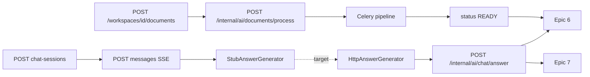

# E2E Upload → Chat Answers — Implementation Plan
### Pod 3: Document Extractor + Chatbot (cross-epic integration)

> **File numbering:** `10_` = cross-epic E2E integration (Epics 1, 4–8). Builds on Epic 8 Checkpoint 2 (`HttpAnswerGenerator` → AI Service).
>
> **Scope:** Backend + Postman only. Frontend auth/upload/chat wiring is out of scope.
>
> **Goal:** Upload a PDF/DOCX, wait until `processingStatus=READY`, create a chat session, ask a question, and receive a grounded answer via `POST /internal/ai/chat/answer` — verifiable in Postman.

---

## 0. PRE-FLIGHT

### 0.1 Problem statement

The chat API shell (sessions, SSE, citations) works today, but answers come from **`StubAnswerGenerator`** — a hardcoded demo string unrelated to the user's question. The AI Service already implements retrieval + generation + verification at `POST /internal/ai/chat/answer`, but **`HttpAnswerGenerator` is a placeholder** and never calls it.

Additionally, chat session scope resolution includes non-`READY` documents, which causes misleading `isNotFound` answers instead of a clear `422 EMPTY_SCOPE` at session creation.

### 0.2 Resolved decisions

| ID | Decision |
|---|---|
| E2E-01 | Chat scope resolves **only `READY`** documents (Epic 8 OQ-8-01). Empty after filter → `422 EMPTY_SCOPE`. |
| E2E-02 | Flip `intellidoc.chat.answer-generator.mode` from `stub` to `http` in Docker Compose for POC demos. |
| E2E-03 | POC default LLM: `LLM_PROVIDER=rules` (deterministic, evidence-based; no external API key). |
| E2E-04 | AI returns one verified JSON response; Core API **chunks `answerText` into SSE `token` events** (Epic 8 CONFLICT-8-02). |
| E2E-05 | Internal wire field name: `resolvedDocumentIds` (matches FastAPI `ChatAnswerRequest`). |

### 0.3 Out of scope

- Frontend JWT login, upload, SSE chat UI
- Epic 9 feedback API
- `POST /internal/ai/evaluation/run`
- Processing watchdog for stuck jobs
- Ollama/hosted LLM setup (optional after rules-based E2E passes)

---

## 1. CURRENT STATE



| Stage | Status | Key files |
|---|---|---|
| Upload + MinIO + job | Done | `DocumentController`, `DocumentService` |
| Processing trigger | Done (fragile) | `AiServiceClient.triggerProcessing()` |
| Ingestion → READY | Done | `ai-service/app/pipeline/orchestrator.py` |
| Chat session + SSE | Done | `ChatMessageService`, `ChatMessageController` |
| Real answers | **Gap** | `HttpAnswerGenerator.java` (placeholder) |
| AI answer endpoint | Done | `ai-service/app/routers/chat_answer.py` |

---

## 2. GAP INVENTORY

### A. Ingestion (upload → READY)

1. `triggerProcessing()` swallows errors — documents can stay `UPLOADED`.
2. Scope resolution includes non-`READY` docs → empty evidence → false `isNotFound`.
3. Graph stage failure marks doc `FAILED` even when chunks/embeddings exist (document in manual test).

### B. Chat answer (Checkpoint 2)

4. `HttpAnswerGenerator` not implemented.
5. `intellidoc.chat.answer-generator.mode` not in `application.yml` / Compose / `.env.example`.
6. Internal wire contract incomplete in `05_api_specs.md` §10.
7. No unit/contract test for `HttpAnswerGenerator`.
8. `AnswerEvent.ERROR` not handled in `ChatMessageService` stream loop.

### C. Docs / Postman

9. README claims Epics 6–10 not started and "do not test chat".
10. Postman lacks ordered E2E folder: upload → poll READY → chat.

---

## 3. IMPLEMENTATION STORIES

### Story E2E-1.1 — Surface processing trigger failures

**Files:** `AiServiceClient.java`

- Log at **ERROR** with `documentId` and exception message when `triggerProcessing` fails.
- Manual test doc lists Celery/ai-service health checks.

**AC:** Failed trigger visible in core-api logs.

---

### Story E2E-1.2 — READY-aware scope resolution

**Files:** `ScopeResolver.java`, `DmsExceptions.java`

- Filter resolved documents to `processingStatus = READY` only.
- `422 EMPTY_SCOPE` message: "No READY documents available in this scope."

**AC:** Session creation with only `UPLOADED` docs returns 422, not a session that always not-founds.

---

### Story E2E-1.3 — Manual E2E test guide

**Files:** `docs/Testing/E2E_UPLOAD_TO_CHAT_MANUAL_TEST.md`

- Login → workspace → upload → poll until READY → chat session → SSE message → citations.
- Troubleshooting: Neo4j URI, graph failures, first-run embedding download.

---

### Story E2E-2.1 — Internal wire contract

**Files:** `AiChatAnswerRequestDto.java`, `AiChatAnswerResponseDto.java`, `AiChatCitationDto.java`, `05_api_specs.md` §10

**Request** `POST /internal/ai/chat/answer`:

```json
{
  "sessionId": "uuid",
  "workspaceId": "uuid",
  "question": "What is this document about?",
  "resolvedDocumentIds": ["uuid-1"],
  "scopeType": "documents",
  "mode": "retrieval_plus_graph",
  "requestId": "optional-uuid"
}
```

**Response** `200`:

```json
{
  "sessionId": "uuid",
  "question": "...",
  "answerMode": "retrieval_plus_graph",
  "answerText": "Grounded answer text.",
  "confidence": 0.88,
  "isNotFound": false,
  "reason": null,
  "citations": [{
    "chunkId": "uuid",
    "documentId": "uuid",
    "documentName": "contract.pdf",
    "pageNumber": 2,
    "sectionHeading": "8.2",
    "sourceExcerpt": "verbatim excerpt"
  }],
  "claims": [],
  "diagnostics": {}
}
```

---

### Story E2E-2.2 — Implement HttpAnswerGenerator

**Files:** `HttpAnswerGenerator.java`, `AiServiceClient.java`

1. `POST {AI_SERVICE_URL}/internal/ai/chat/answer`
2. Map response → `AnswerEvent`:
   - `answerText` → chunked `TOKEN` events (~200 chars)
   - `citations[]` → `CITATION` events
   - `isNotFound`, `confidence`, `answerMode` → `FINAL`
3. HTTP/timeout failures → `AnswerEvent.error("UPSTREAM_FAILURE", ...)`

---

### Story E2E-2.3 — Configuration

**Files:** `application.yml`, `docker-compose.yml`, `.env.example`

```yaml
intellidoc:
  chat:
    answer-generator:
      mode: ${CHAT_ANSWER_GENERATOR_MODE:stub}
    upstream:
      timeout-ms: ${CHAT_UPSTREAM_TIMEOUT_MS:120000}
```

Docker `core-api`: `CHAT_ANSWER_GENERATOR_MODE=http`

---

### Story E2E-2.4 — Tests

**Files:** `HttpAnswerGeneratorTest.java`, `ChatApiTest.java`

- Unit test: mocked `AiServiceClient` → assert TOKEN/CITATION/FINAL sequence.
- Integration: non-`READY` doc → `422 EMPTY_SCOPE` on session create.
- Existing stub tests unchanged (`mode=stub` in test profile).

---

### Story E2E-3.1 — AI service happy-path test

**Files:** `ai-service/tests/test_chat_answer_route.py`

- Mock `RetrievalService.retrieve` to return evidence → assert `isNotFound=false` and non-empty `answerText`.

---

### Story E2E-3.2 — Compose env completeness

**Files:** `docker-compose.yml` (`ai-service`)

- Pass `RERANKER_PROVIDER`, `RETRIEVAL_GRAPH_ENABLED`, `LLM_PROVIDER=rules` explicitly.

---

### Story E2E-4.1 — Postman E2E folder

**Files:** `postman/IntelliDoc-Epic01-DMS.postman_collection.json`

Folder **9. E2E Upload → Chat**: login → workspace → upload → poll READY → session → message → citations.

---

### Story E2E-4.2 — README update

**Files:** `README.md`

- Epics 6–8 in repo; chat testable via Postman when `CHAT_ANSWER_GENERATOR_MODE=http`.
- Link to `E2E_UPLOAD_TO_CHAT_MANUAL_TEST.md`.

---

## 4. ACCEPTANCE CRITERIA (Definition of Done)

| # | Criterion | Verification |
|---|---|---|
| AC-1 | Upload → document reaches `READY` | Manual test / Postman poll |
| AC-2 | Non-READY scope → `422 EMPTY_SCOPE` | Postman negative test |
| AC-3 | `mode=http` answer reflects uploaded doc content | Question about doc topic; not stub text |
| AC-4 | SSE: `token`, `citation`, `done` | Postman stream |
| AC-5 | `GET /chat-sessions/{id}` has assistant message | Postman |
| AC-6 | Citations match streamed events | Postman |
| AC-7 | `mode=stub` regression | `ChatApiTest` green |
| AC-8 | `HttpAnswerGeneratorTest` green | CI |

---

## 5. TASK ORDER

1. E2E-1.2 ScopeResolver READY filter
2. E2E-1.1 Trigger logging
3. E2E-2.1 DTOs + wire contract doc
4. E2E-2.2 HttpAnswerGenerator + AiServiceClient
5. E2E-2.3 Config (application.yml, Compose, .env.example)
6. E2E-2.4 Tests + ChatMessageService ERROR handling
7. E2E-3.1–3.2 AI service test + Compose env
8. E2E-1.3 Manual test doc
9. E2E-4.1–4.2 Postman + README

**Estimated effort:** 1.5–2 dev days.

---

## 6. RELATED PLANS

| Plan | Relationship |
|---|---|
| `09_EPIC_08_CHAT_API_AND_CITATIONS_IMPLEMENTATION_PLAN.md` | Defines Checkpoint 2 (`HttpAnswerGenerator`) |
| `07_EPIC_06_HYBRID_RETRIEVAL_AND_RERANKING_IMPLEMENTATION_PLAN.md` | Upstream retrieval |
| `08_EPIC_7_Answer_Generation_and_Verification_IMPLEMENTATION_PLAN.md` | Upstream generation/verification |
| `docs/Testing/INGESTION_PIPELINE_MANUAL_TEST.md` | Upload → READY prerequisite |
