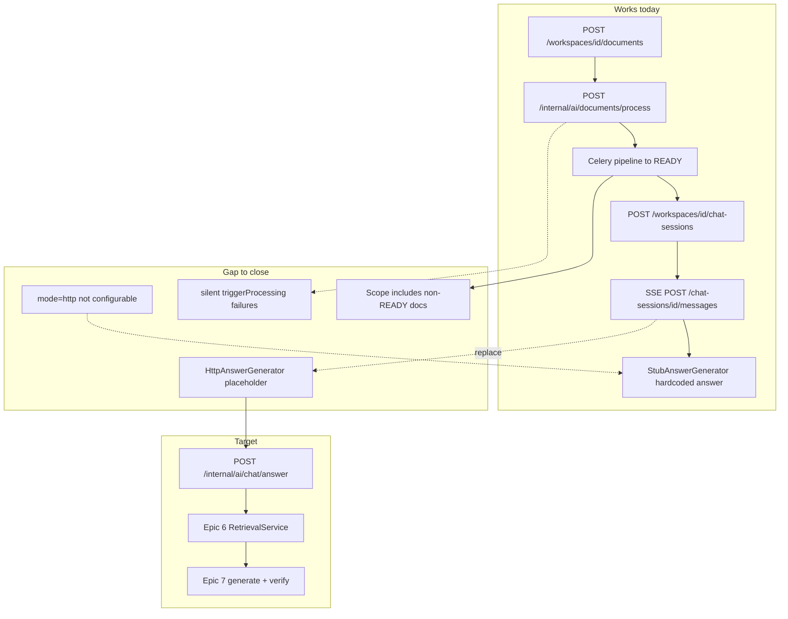

# E2E Upload → Chat Answers Implementation Plan

**Deliverable file (written after your approval):** [`docs/Implementation/10_E2E_UPLOAD_TO_CHAT_IMPLEMENTATION_PLAN.md`](docs/Implementation/10_E2E_UPLOAD_TO_CHAT_IMPLEMENTATION_PLAN.md)

**Scope:** Backend + Postman only. No frontend auth/upload/chat wiring in this pass.

**Goal:** A user can upload a PDF/DOCX, wait until `processingStatus=READY`, create a chat session, ask a question, and receive an answer grounded in that document (via real retrieval + generation), verifiable in Postman.

---

## Current state vs target



| Stage | Status | Key files |
|-------|--------|-----------|
| Upload + MinIO + job row | Done | [`DocumentController.java`](backend/src/main/java/com/intellidoc/backend/controller/DocumentController.java), [`DocumentService.java`](backend/src/main/java/com/intellidoc/backend/service/DocumentService.java) |
| AI processing trigger | Done (fragile) | [`AiServiceClient.java`](backend/src/main/java/com/intellidoc/backend/client/AiServiceClient.java) L216–237 |
| Ingestion pipeline → READY | Done | [`orchestrator.py`](ai-service/app/pipeline/orchestrator.py) |
| Chat session + SSE shell | Done | [`ChatMessageService.java`](backend/src/main/java/com/intellidoc/backend/chat/ChatMessageService.java) |
| Real answer generation | **Missing** | [`HttpAnswerGenerator.java`](backend/src/main/java/com/intellidoc/backend/chat/HttpAnswerGenerator.java) (4-line stub) |
| AI answer endpoint | Done | [`chat_answer.py`](ai-service/app/routers/chat_answer.py) |

---

## Gap inventory (what the plan must close)

### A. Ingestion path (upload → READY)

1. **Silent processing trigger failure** — `triggerProcessing()` swallows errors; documents can stay `UPLOADED` forever.
2. **No READY filter at session scope** — [`ScopeResolver`](backend/src/main/java/com/intellidoc/backend/chat/ScopeResolver.java) includes all non-deleted docs; AI service excludes non-READY → empty evidence → misleading `isNotFound`.
3. **Operational visibility** — no API to poll processing status beyond `GET /documents/{id}` (acceptable for Postman; document the wait loop).
4. **Graph stage can fail whole doc** — if Neo4j/graph build fails, doc stays `FAILED` even when chunks/embeddings exist; document troubleshooting in manual test section.

### B. Chat answer path (Checkpoint 2)

5. **`HttpAnswerGenerator` not implemented** — never calls `{AI_SERVICE_URL}/internal/ai/chat/answer`.
6. **Config toggle missing from env** — `intellidoc.chat.answer-generator.mode` defaults to `stub`; not in [`application.yml`](backend/src/main/resources/application.yml), [`.env.example`](.env.example), or [`docker-compose.yml`](docker-compose.yml).
7. **Wire contract undocumented** — align Java DTOs with [`ChatAnswerRequest`/`ChatAnswerResponse`](ai-service/app/routers/chat_answer.py) in [`05_api_specs.md`](docs/ReqAndDesign/05_api_specs.md) §10.
8. **No contract/integration test** — Epic 8 TASK-8-18 (WireMock) not done.
9. **Upstream error mapping** — `AnswerEvent.error()` exists but generators don't emit it on 503/timeout.

### C. Docs / Postman / README

10. **README outdated** — still says Epics 6–10 not started and "do not test chat".
11. **Postman** — chat folder exists but no documented happy-path sequence: upload → poll READY → chat.
12. **`contracts/ai-service-api.yaml`** — missing internal endpoints (lower priority; note in plan).

---

## Implementation phases

### Phase 0 — Document the plan (this step)

Write [`10_E2E_UPLOAD_TO_CHAT_IMPLEMENTATION_PLAN.md`](docs/Implementation/10_E2E_UPLOAD_TO_CHAT_IMPLEMENTATION_PLAN.md) using the same structure as existing epic plans (`00` pre-flight, gap table, stories/tasks, acceptance criteria, test plan). **No coding until you approve.**

---

### Phase 1 — Ingestion hardening + READY semantics

**Story E2E-1.1 — Surface processing trigger failures**

- In [`AiServiceClient.triggerProcessing()`](backend/src/main/java/com/intellidoc/backend/client/AiServiceClient.java): log at ERROR with `documentId`; optionally mark job failed or expose a metric (minimal: structured log + integration test that mock failure is visible).
- Acceptance: failed trigger is observable in core-api logs; manual test doc lists how to verify Celery/ai-service is reachable.

**Story E2E-1.2 — READY-aware scope resolution**

- Update [`ScopeResolver`](backend/src/main/java/com/intellidoc/backend/chat/ScopeResolver.java) / [`ChatSessionService`](backend/src/main/java/com/intellidoc/backend/chat/ChatSessionService.java) to resolve only documents with `processingStatus = READY` (per Epic 8 OQ-8-01 recommendation).
- If resolved set is empty after filtering: return `422 EMPTY_SCOPE` with message like "No READY documents in scope."
- Acceptance: session creation against workspace with only `UPLOADED` docs returns 422, not a session that always not-founds.

**Story E2E-1.3 — Manual E2E ingestion checklist**

- Add [`docs/Testing/E2E_UPLOAD_TO_CHAT_MANUAL_TEST.md`](docs/Testing/E2E_UPLOAD_TO_CHAT_MANUAL_TEST.md): login → workspace → upload → poll `GET /documents/{id}` until `READY` → verify chunks/embeddings in Postgres (optional SQL) → proceed to chat.
- Reuse patterns from [`INGESTION_PIPELINE_MANUAL_TEST.md`](docs/Testing/INGESTION_PIPELINE_MANUAL_TEST.md).

---

### Phase 2 — Wire HttpAnswerGenerator (Checkpoint 2)

**Story E2E-2.1 — Internal wire contract**

Add Java DTOs mirroring ai-service:

```java
// Request → POST /internal/ai/chat/answer
{ sessionId, workspaceId, question, resolvedDocumentIds[], mode, scopeType?, requestId? }

// Response ← 200
{ answerText, answerMode, confidence, isNotFound, reason?, citations[], claims[], diagnostics? }
```

- Map `AnswerRequest` fields in [`AnswerRequest.java`](backend/src/main/java/com/intellidoc/backend/chat/AnswerRequest.java).
- Document finalized contract in plan doc §7 and patch [`05_api_specs.md`](docs/ReqAndDesign/05_api_specs.md) §10 response shape.

**Story E2E-2.2 — Implement HttpAnswerGenerator**

Replace placeholder in [`HttpAnswerGenerator.java`](backend/src/main/java/com/intellidoc/backend/chat/HttpAnswerGenerator.java):

1. `POST {intellidoc.ai-service.url}/internal/ai/chat/answer` via `RestTemplate` or extend [`AiServiceClient`](backend/src/main/java/com/intellidoc/backend/client/AiServiceClient.java).
2. Map response → `AnswerEvent` stream:
   - `answerText` → chunk into `TOKEN` events (~200 char splits or sentence boundaries)
   - each `citations[]` → `CITATION` (`documentId`, `chunkId`, `pageNumber`, `sectionHeading`, `sourceExcerpt`)
   - metadata → `FINAL` (`isNotFound`, `confidence`, `answerMode`)
3. Error handling:
   - HTTP 503/500/timeout → `AnswerEvent.error("UPSTREAM_FAILURE", ...)`
   - `isNotFound=true` → emit not-found tokens from `answerText`, zero citations, `FINAL` with `isNotFound=true`

**Story E2E-2.3 — Configuration**

Add to [`application.yml`](backend/src/main/resources/application.yml):

```yaml
intellidoc:
  chat:
    answer-generator:
      mode: ${CHAT_ANSWER_GENERATOR_MODE:stub}
    upstream:
      timeout-ms: ${CHAT_UPSTREAM_TIMEOUT_MS:120000}
```

- Propagate `CHAT_ANSWER_GENERATOR_MODE=http` in [`docker-compose.yml`](docker-compose.yml) `core-api` environment.
- Add to [`.env.example`](.env.example).

**Story E2E-2.4 — Tests**

- WireMock test: mock `/internal/ai/chat/answer` → assert SSE events in [`ChatApiTest`](backend/src/test/java/com/intellidoc/backend/chat/ChatApiTest.java) or new `HttpAnswerGeneratorTest`.
- Keep existing stub tests; add `@TestPropertySource` profile for `mode=http` integration path.

---

### Phase 3 — AI service validation (minimal)

**Story E2E-3.1 — Happy-path route test**

- Extend [`ai-service/tests/test_chat_answer_route.py`](ai-service/tests/test_chat_answer_route.py) with seeded READY doc + chunk + embedding fixture (or testcontainers) to assert non–not-found response when evidence exists.

**Story E2E-3.2 — Compose env completeness**

- Pass critical `RETRIEVAL_*` and `LLM_PROVIDER=rules` explicitly in [`docker-compose.yml`](docker-compose.yml) `ai-service` for reproducible POC answers without external LLM.

Default POC: `LLM_PROVIDER=rules` (deterministic, evidence-based answers from chunks — sufficient to prove E2E).

---

### Phase 4 — Postman + README

**Story E2E-4.1 — Postman happy path folder**

Update [`postman/IntelliDoc-Epic01-DMS.postman_collection.json`](postman/IntelliDoc-Epic01-DMS.postman_collection.json):

- New folder **"9. E2E Upload → Chat"** with ordered requests:
  1. Login
  2. Create workspace
  3. Upload file
  4. Poll `GET /documents/{id}` until `processingStatus == READY` (Postman pre-request script with delay/retry)
  5. Create chat session (workspace scope)
  6. POST message (SSE)
  7. GET session (verify assistant `content`)
  8. GET citations + source

**Story E2E-4.2 — README update**

- Fix Epic status table in [`README.md`](README.md): Epics 6–8 in repo; chat testable via Postman when `CHAT_ANSWER_GENERATOR_MODE=http`.
- Link to new manual test doc.

---

## End-to-end acceptance criteria (Definition of Done)

| # | Criterion | How to verify |
|---|-----------|---------------|
| AC-1 | Upload returns 202 and document eventually reaches `READY` | Postman poll or manual test doc |
| AC-2 | Chat session rejects empty/non-READY scope with 422 | Postman negative test |
| AC-3 | `CHAT_ANSWER_GENERATOR_MODE=http` produces answer text derived from uploaded doc content | Ask "What is this document about?" — answer references USENIX/template text, not "30 days notice" stub |
| AC-4 | SSE emits `token`, `citation`, `done` events | Postman stream view |
| AC-5 | `GET /chat-sessions/{id}` shows persisted user + assistant messages | Postman |
| AC-6 | `GET /messages/{id}/citations` matches streamed citations | Postman |
| AC-7 | Stub mode still works when `mode=stub` (regression) | Existing `ChatApiTest` pass |
| AC-8 | WireMock/contract test for HttpAnswerGenerator | CI green |

---

## Suggested task order (coding, after approval)

1. Write plan markdown file to `docs/Implementation/`
2. Phase 1: READY scope filter + trigger logging
3. Phase 2: DTOs + HttpAnswerGenerator + config
4. Phase 2: Tests
5. Phase 3: ai-service test + compose env
6. Phase 4: Postman + README + manual test doc

**Estimated effort:** ~1.5–2 dev days (backend-focused; no frontend).

---

## Out of scope (explicit)

- Frontend JWT login, upload, SSE chat UI ([`copilot-sidebar.jsx`](frontend/src/components/features/copilot-sidebar.jsx) still mock)
- Epic 9 feedback API
- Evaluation run endpoint (`POST /internal/ai/evaluation/run`)
- Processing watchdog / stuck-job recovery (document as follow-up)
- Switching to Ollama/hosted LLM (optional upgrade after rules-based E2E passes)

---

## Approval gate

**Review the plan document first.** Once you approve, switch to Agent mode and say **"approved, start coding"** — implementation will follow the phase order above and will not begin before your explicit go-ahead.
