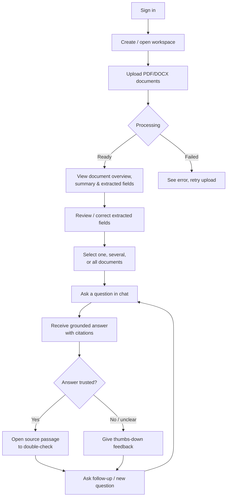
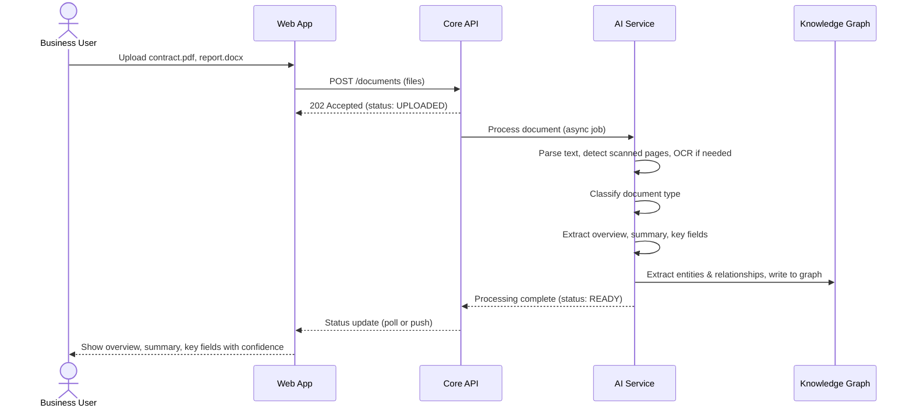
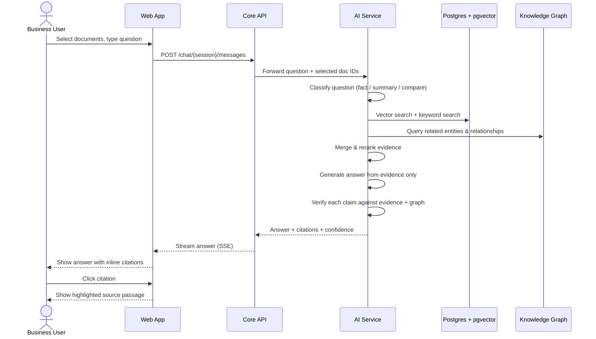
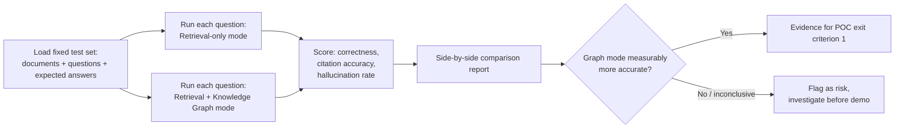

# Requirements & User Journeys — Pod 3: Document Extractor + Chatbot

> Builds on `BRD_Pod3_DocumentExtractor_Chatbot.docx` (Section 8, Functional Requirements). This doc translates those requirements into user stories and walks through how a real person moves through the product.

---

## 1. Personas

| Persona | Who they are | What they need from the POC |
|---|---|---|
| **Business User** | Any internal employee (legal, finance, sales, ops) with a set of documents to understand | Upload documents, see them understood automatically, ask questions, trust the answers |
| **QA / Evaluator** | Pod 3 team member responsible for proving accuracy | Run a fixed test set, compare retrieval-only vs. retrieval+graph, produce numbers |
| **Leadership / Demo Viewer** | Sponsor deciding on funding | Watch a smooth, believable, end-to-end demo |

---

## 2. User stories (by capability)

### 2.1 Document Upload & Management
- As a Business User, I want to create a workspace, so that I can group documents that belong to the same task or project.
- As a Business User, I want to upload a whole folder of documents at once and have its subfolders become modules automatically, so that my existing folder structure (e.g. "Finance", "Governance") carries over without manual re-organizing.
- As a Business User, I want to upload several PDF/DOCX files at once, so that I don't have to add them one by one.
- As a Business User, I want to see each document's processing status (uploading → processing → ready/failed), so that I know when I can start asking questions.
- As a Business User, I want to select a whole workspace, a single module, or one/several individual documents, so that I control exactly what my question is answered against.

> **Non-negotiable rule:** workspaces are fully isolated from each other. Two workspaces can have identically-named modules (e.g. both "Finance" and "Governance" workspaces can have a "Contracts" module) and can mention the same real-world entities — and answers, citations, or contradiction checks must **never** merge or leak between them, under any circumstance. This is a correctness guarantee, not a preference — see `03_architecture.md` §5 and `04_db_mapping_and_er_diagram.md` §3 for how it's enforced at the data layer, and `06_backend_epics_and_stories.md` Stories 5.3/5.4/6.2/8.5 for the specific tests that verify it.

### 2.2 Automatic Understanding & Extraction
- As a Business User, I want the system to figure out what type of document I uploaded, so that I don't have to tell it in advance.
- As a Business User, I want a short overview and summary of each document, so that I can quickly understand it without reading it fully.
- As a Business User, I want key fields (dates, amounts, people, organisations, obligations) pulled out automatically, so that I don't manually search for them.
- As a Business User, I want to see where each extracted fact came from (document + page) and how confident the system is, so that I can trust or double-check it.
- As a Business User, I want to correct or delete a wrong extracted field, so that the record stays accurate.

### 2.3 Knowledge Graph (Accuracy Layer)
- As the System, I need to build a graph of entities and relationships within and across documents, so that facts can be cross-checked, not just text-matched.
- As a Business User, I want the system to flag contradictions between documents (e.g. two different expiry dates), so that I don't miss a conflict.

### 2.4 Chat & Question Answering
- As a Business User, I want to ask a plain-language question about my selected document(s), so that I don't have to read the whole thing.
- As a Business User, I want the answer to come only from my documents (not the AI's general knowledge), so that I can trust it in a business context.
- As a Business User, I want the system to say "not found" rather than guess, so that I'm never misled.
- As a Business User, I want to ask comparison questions across documents (e.g. "what's different between these two contracts?") and get facts correctly attributed to each document.

### 2.5 Citations & Evidence
- As a Business User, I want every answer to show which document/page/section it came from, so that I can verify it.
- As a Business User, I want to click through to the exact source passage, so that I don't have to hunt for it myself.

### 2.6 Evaluation & Feedback
- As a QA/Evaluator, I want to run a fixed set of test questions against a fixed set of test documents, so that accuracy is measured consistently, not anecdotally.
- As a QA/Evaluator, I want to see, side by side, how an answer differs between retrieval-only and retrieval+graph, so that I can prove the value of the graph.
- As a Business User, I want to give a thumbs-up/down on an answer, so that the team can find weak spots.

---

## 3. End-to-end user journey (overview)

---

## 4. Journey detail: Upload → Understanding

---

## 5. Journey detail: Asking a question (the core interaction)

---

## 6. Journey detail: Evaluation run (QA persona)

---

## 7. Non-functional requirements (carried from BRD §9, for reference)

| Area | Requirement |
|---|---|
| Accuracy | Highest priority; tuned before speed or features |
| Performance | First response within a few seconds for a typical question (demo-grade, not production-grade) |
| Usability | Clear enough for someone unfamiliar to follow live, without deep polish |
| Security | Baseline login + safe file handling; deeper controls pending data-sensitivity decision |
| Reliability | Must reliably complete a demo run |
| Scalability | Not a priority — POC test set and demo scenarios only |
| Auditability | Basic logging of uploads, questions, answers |
