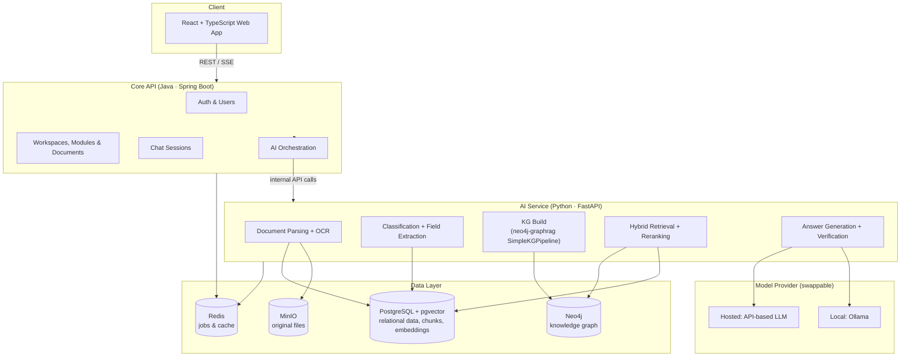
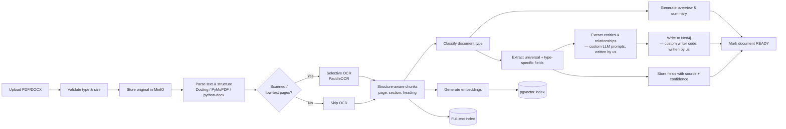
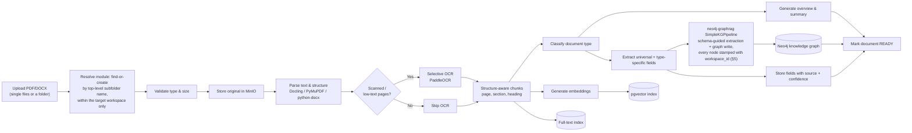
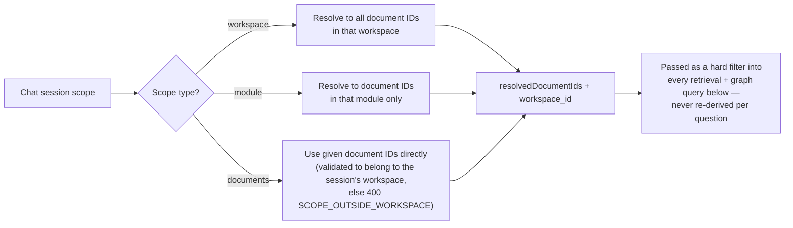
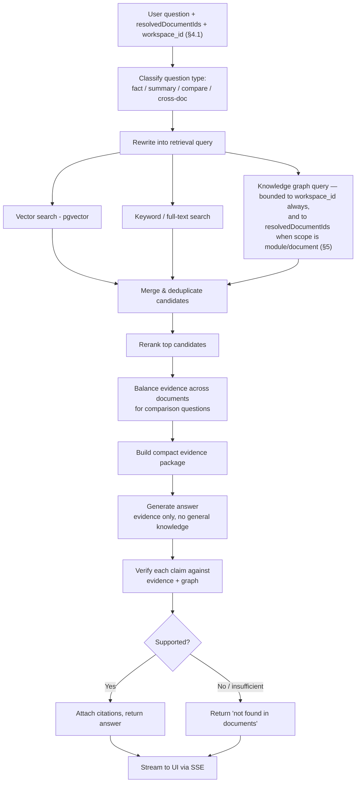
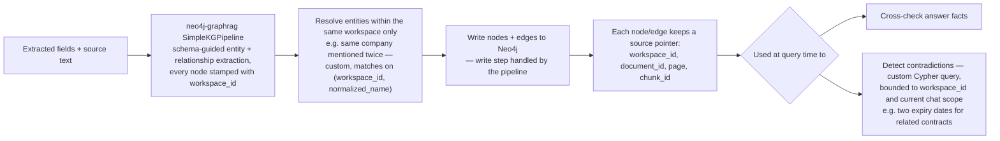
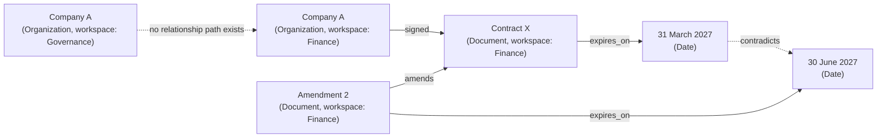
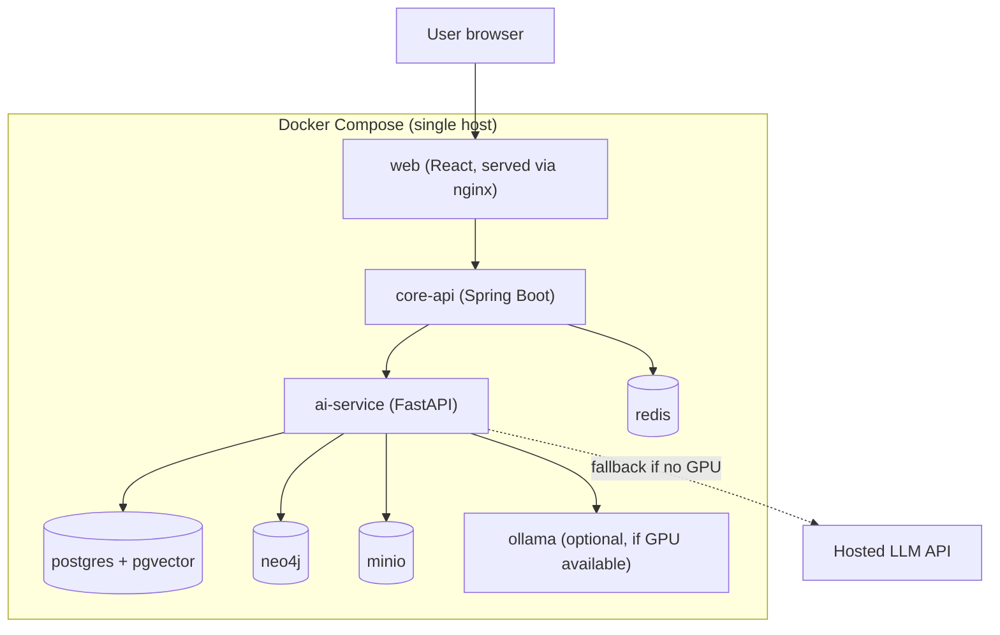

# Architecture — Pod 3: Document Extractor + Chatbot

> Technical companion to the BRD. This doc makes the architectural decisions needed to actually build the POC in 4 weeks, biased toward the simplest thing that still proves the GraphRAG accuracy hypothesis.

---

## 1. Architectural principles for this POC

1. **Prove the hypothesis, don't over-engineer.** Every extra moving part is time taken away from the accuracy proof. If something isn't needed to hit the two exit criteria (accuracy proof + demo), defer it.
2. **Keep the LLM provider swappable.** GPU/compute availability is an open item (BRD §15). Build a thin model-provider interface so we can point at a local model (Ollama) or a hosted API without rewriting the pipeline.
3. **Three representations of every document**, kept separate so citations always trace back to the real source:
   - **Original file** (PDF/DOCX) — for audit and download.
   - **Source-faithful extracted text** — exact paragraphs, pages, sections — used for citations.
   - **Knowledge graph facts** — entities/relationships derived from the text — used to ground and cross-check answers, never treated as the source of truth itself.
4. **Graph-in-Postgres is the fallback, Neo4j is the primary choice.** Neo4j (Community, single Docker container) gives a built-in graph browser that is genuinely useful for the leadership demo (literally showing the graph). If graph-building risk materialises (BRD §14 top risk), fall back to a simple `entities` / `relationships` table pair in Postgres — same data model, no visual browser.
5. **Use the official `neo4j-graphrag-python` library for graph construction, not fully custom code.** *(Decision added this session — see §3 for the full before/after.)* Entity/relationship extraction and the Neo4j writer are provided by the library's `SimpleKGPipeline`, configured with our own schema. This reduces custom build time on the highest-risk epic without changing the architecture's shape — parsing/OCR, business-field extraction, pgvector, and Postgres full-text search are all unaffected.
6. **Strict workspace isolation, enforced at write time, not just query time.** *(Decision added this session.)* Documents can be organized into an optional **module** (folder) layer within a workspace, and chat can be scoped to a whole workspace, a single module, or specific documents. But workspaces themselves never interlink — two workspaces can have identically-named modules and mention the same real-world entities, and must never share a graph node, a citation, or a contradiction result. This is guaranteed by stamping `workspace_id` on every graph node at creation time (§5, §4.1) and bounding every retrieval/graph query to it, not by hoping downstream filters catch it. See `04_db_mapping_and_er_diagram.md` §3 for the schema-level enforcement.

---

## 2. High-level system architecture

---

## 3. Document ingestion pipeline — Before / After

> **What changed and why:** extraction (parsing + OCR) has to happen no matter what tooling we pick for the graph — nothing reads a PDF for us. What we're changing is the **knowledge-graph construction step**: instead of hand-writing entity extraction, relationship extraction, and a Neo4j writer, we configure the official `neo4j-graphrag-python` library's `SimpleKGPipeline` with our own schema. Everything upstream of that (upload, parsing, OCR, chunking, classification, business-field extraction, pgvector, full-text index) is untouched.

### 3.1 Before — fully custom build

### 3.2 After — neo4j-graphrag-python handles KG construction

### 3.3 What actually changed

| Stage | Before | After | Changed? |
|---|---|---|---|
| Upload, validate, store original | Custom | Same | No |
| Module (folder) resolution | Did not exist | Find-or-create module per subfolder, workspace-bounded | **Yes — added later this session** |
| Parse text & structure | Docling / PyMuPDF / python-docx | Same | No |
| Selective OCR | PaddleOCR | Same | No |
| Structure-aware chunking | Custom | Same | No |
| Document classification | Custom LLM call | Same | No |
| Business field extraction | Custom LLM call | Same | No |
| Embeddings + pgvector index | Custom | Same | No |
| Full-text index | Postgres full-text search | Same | No |
| Entity + relationship extraction | Two custom LLM prompts, written and tuned by us | `SimpleKGPipeline`, schema-guided, one configured call, workspace_id-stamped | **Yes** |
| Writing to Neo4j | Custom writer code | Handled by the library | **Yes** |

### 3.4 One open call worth flagging: where vectors live

`neo4j-graphrag-python` *can* also host vector and full-text indexes natively inside Neo4j (its `HybridRetriever` / `HybridCypherRetriever` are built around that). We're deliberately **not** doing that here — pgvector and Postgres full-text search stay exactly as already scoped in `04_db_mapping_and_er_diagram.md`. Reasons: it keeps the "three representations of a document" principle clean (source-faithful text + its embeddings live together in Postgres; Neo4j stays purely the facts/relationships layer), and it avoids reopening the DB schema doc mid-sprint. This is a real alternative if you'd rather consolidate everything into Neo4j — it's a bigger, riskier change to make in Week 1, so flagging it rather than deciding it silently.

**Processing status states (unchanged):** `UPLOADED → PARSING → EXTRACTING → INDEXING → READY` (or `FAILED` at any stage, with retry).

---

## 4. Question-answering pipeline (hybrid RAG + graph verification)

### 4.1 Scope resolution — runs before any retrieval, enforces the isolation rule

### 4.2 Retrieval + generation flow

---

## 5. Knowledge graph construction (the differentiator, in detail)

> Updated per §3.2 — the extraction + write steps (B–D below) are now `SimpleKGPipeline`, configured with our schema, instead of custom prompts and a custom writer. Entity resolution and contradiction detection are **not** part of the library and remain fully custom. **`workspace_id` is stamped on every node at creation time (step B)** — this, plus scoping entity resolution's match query to `(workspace_id, normalized_name)`, is what actually prevents two workspaces from ever merging the same real-world entity into one node.

Example graph shape:

*Two nodes both named "Company A" — one per workspace — are deliberately unconnected. This is the isolation rule from §1 principle 6, drawn as it actually exists in the graph.*

---

## 6. Deployment view (POC)

One `docker-compose up` should bring up the full stack for local dev and for the demo environment. Kubernetes, autoscaling, and multi-region are explicitly out of scope (BRD §5.2).

---

## 7. Recommended tech stack

| Layer | Technology | Why |
|---|---|---|
| Frontend | React + TypeScript, Vite, Tailwind + shadcn/ui | Fast to build, matches likely team skills |
| Core API | Java 21 + Spring Boot 3 | Handles auth, workspaces, documents, chat sessions, orchestration |
| AI service | Python + FastAPI | Parsing, extraction, retrieval, generation — Python has the best AI/ML library support |
| Parsing | Docling (primary), PyMuPDF / python-docx (fallback) | Handles both PDF and DOCX structure |
| OCR | PaddleOCR, invoked only on low-text pages | Keeps ingestion fast for normal (non-scanned) documents |
| Relational DB | PostgreSQL | Core data + metadata |
| Vector search | pgvector (extension on the same Postgres) | One fewer service to run; good enough at POC scale |
| Keyword search | PostgreSQL full-text search | Exact phrase / ID / clause matching |
| Knowledge graph | Neo4j Community (Docker) | Purpose-built graph queries + visual browser for the demo; fallback: entity/relationship tables in Postgres |
| KG construction library | `neo4j-graphrag-python` (official Neo4j package) | Schema-guided entity/relationship extraction + Neo4j writer, provided out of the box — see §3 before/after |
| File storage | MinIO | S3-compatible, self-hosted, no cloud dependency for the POC |
| Jobs / cache | Redis + Celery | Async document processing |
| LLM | Ollama (local) **or** a hosted LLM API, behind one interface | Keeps the GPU-availability open item from blocking the build |
| Embeddings / reranking | BGE-M3 embeddings, BGE reranker (or equivalent) | Open, well-established, works locally |
| Packaging | Docker Compose | Fits a 4-week POC; Kubernetes deferred |
| CI | GitHub Actions (build + test) | Lightweight |

---

## 8. What this architecture deliberately does NOT include (POC)

Matches BRD §5.2 — no SSO, no multi-tenant billing, no Excel/PPT/image/audio support, no high-availability, no user-editable graph, no external system integrations, no mobile app, no Kubernetes.

---

## 9. Risk-driven design notes

- **KG timeboxed (BRD top risk):** build the graph schema simple (5–6 entity types, ~5 relationship types) so it can be delivered in Week 1–2 even under time pressure; a working simple graph beats an ambitious unfinished one.
- **Every answer must be traceable:** citations always resolve to the source-faithful text representation, never directly to an LLM-generated summary — this is what makes "verify every answer" possible.
- **Model-provider abstraction** de-risks the unresolved GPU/compute question without adding real build time (it's one interface with two implementations).
- **`neo4j-graphrag-python` lowers, but doesn't eliminate, the KG risk.** It removes the need to hand-build extraction prompts and a Neo4j writer, but entity resolution (Story 5.3) and contradiction detection (Story 5.4) are still fully custom — those stay the real risk items to watch in Week 1–2.
- **Workspace isolation is a correctness guarantee, not a feature to trim.** It adds real effort to the senior-owned epics (5 and 6) and pushed that track over its planned capacity — see `07_realistic_timeline_and_task_plan.md` §3 for the pairing plan that absorbs it. A leak here (two workspaces' answers merging) is worse than a missed feature: it's silently wrong output that looks confident, which directly undermines the whole "near-zero hallucination, trustworthy" premise of the POC.
