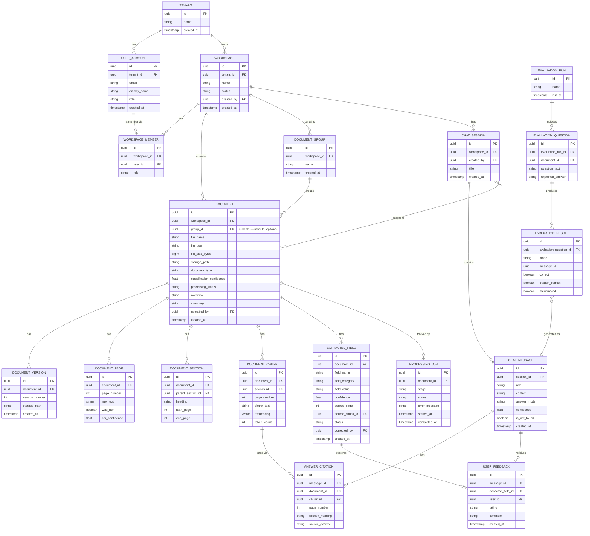
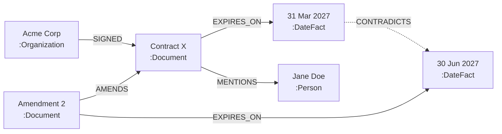

# Database Mapping & ER Diagrams — Pod 3: Document Extractor + Chatbot

> Two data stores, kept intentionally separate: **PostgreSQL** (relational — everything that has a clear owner, a status, and needs transactional integrity) and **Neo4j** (graph — entities and relationships, used to ground and verify answers). Both reference each other via IDs, never by duplicating truth.

---

## 1. Relational schema — ER diagram (PostgreSQL)

---

## 2. Table notes (fields worth explaining)

| Table | Notes |
|---|---|
| `TENANT` | Present from day one even though the POC only has one internal tenant — avoids a painful future migration (BRD §10, future-proofing note). |
| `DOCUMENT_GROUP` (module) | Represents a folder/module within one workspace (e.g. mirrors a subfolder from a multi-file upload). **Unique on `(workspace_id, name)`, not on `name` alone** — "Finance" workspace and "Governance" workspace can each have their own "Contracts" module; they are entirely separate rows and never share data. `document.group_id` is nullable — a document doesn't have to belong to a module. |
| `DOCUMENT.processing_status` | One of `UPLOADED, PARSING, EXTRACTING, INDEXING, READY, FAILED`. |
| `DOCUMENT_CHUNK.embedding` | `vector` type via the pgvector extension; indexed with an IVFFlat or HNSW index for similarity search. |
| `EXTRACTED_FIELD.status` | One of `AI_GENERATED, CONFIRMED, CORRECTED, REMOVED` — tracks the human-in-the-loop review requirement (BRD §8.2). |
| `CHAT_MESSAGE.answer_mode` | `retrieval_only` or `retrieval_plus_graph` — required for the accuracy comparison (BRD §8.6). |
| `CHAT_MESSAGE.is_not_found` | True when the system correctly declines to answer — tracked as its own metric, not a failure. |
| `EVALUATION_RESULT` | One row per test question **per mode**, so retrieval-only and retrieval+graph runs are directly comparable side by side. |

---

## 3. Knowledge graph schema (Neo4j)

The graph is deliberately simple — enough entity/relationship types to prove the hypothesis, not a general-purpose ontology.

> **Strict workspace isolation rule (non-negotiable):** two workspaces can mention the same real-world entity (e.g. "Acme Corp" appears in both a Finance workspace and a Governance workspace) and they must **never** resolve to the same graph node or surface in each other's answers, contradiction checks, or traversals — even though they'd normally merge under same-workspace entity resolution (§ below, Story 5.3). To guarantee this, **`workspace_id` is a required property on every node type**, not just `:Document`. Without it, normalized-name matching during entity resolution has no way to tell "Acme Corp in Finance" apart from "Acme Corp in Governance," and the two would silently merge into one node — a real bug this schema is written to prevent, not just discourage.

### Node labels

| Node label | Key properties | Example |
|---|---|---|
| `:Document` | `document_id`, `workspace_id`, `group_id` (nullable), `title`, `document_type` | "Service Agreement.pdf" |
| `:Organization` | `workspace_id`, `name`, `normalized_name` | "Acme Corp" |
| `:Person` | `workspace_id`, `name`, `normalized_name` | "Jane Doe" |
| `:DateFact` | `workspace_id`, `value` (ISO date), `label` (e.g. "expiry date") | 2027-03-31 |
| `:Amount` | `workspace_id`, `value`, `currency`, `label` | 4,800,000 INR |
| `:Topic` | `workspace_id`, `name` | "termination clause" |

Every node also carries a `source_chunk_id` and `source_page` property pointing back to the relational `DOCUMENT_CHUNK` table — this is what lets the graph be used to *ground* an answer instead of being trusted blindly.

### Relationship types

| Relationship | From → To | Example |
|---|---|---|
| `SIGNED` | `:Organization` → `:Document` | Acme Corp -SIGNED-> Contract X |
| `EXPIRES_ON` | `:Document` → `:DateFact` | Contract X -EXPIRES_ON-> 31 Mar 2027 |
| `AMENDS` | `:Document` → `:Document` | Amendment 2 -AMENDS-> Contract X |
| `MENTIONS` | `:Document` → `:Person` / `:Organization` / `:Topic` | Contract X -MENTIONS-> Jane Doe |
| `HAS_VALUE` | `:Document` → `:Amount` | Proposal Y -HAS_VALUE-> ₹4.8 crore |
| `CONTRADICTS` | `:DateFact`/`:Amount` → same type | Two conflicting expiry dates |

### Example graph instance

*(`workspace_id` omitted from node labels above for readability — every node shown here belongs to the same workspace; a same-named "Acme Corp" in a different workspace would be a completely separate, unconnected node.)*

### Relational ↔ graph mapping

| Relational side | Graph side | Link |
|---|---|---|
| `DOCUMENT.id` | `:Document.document_id` | Same UUID, kept in sync when a document is created |
| `DOCUMENT.workspace_id` | every node's `workspace_id` property | Stamped on every node at creation time — the isolation boundary, enforced at write time, not just query time |
| `DOCUMENT_CHUNK.id` | node `source_chunk_id` property | Lets any graph fact resolve back to its exact source passage for citation |
| `EXTRACTED_FIELD` | `:Amount`, `:DateFact`, etc. | Extracted fields are the input to graph-node creation, not a separate parallel truth |

---

## 4. Indexing plan

| Store | Index | Purpose |
|---|---|---|
| Postgres | HNSW (or IVFFlat) on `document_chunk.embedding` | Vector similarity search |
| Postgres | GIN full-text index on `document_chunk.chunk_text` | Keyword/exact-phrase search |
| Postgres | B-tree on `document.workspace_id`, `document.group_id`, `chat_session.workspace_id` | Standard lookups/filtering |
| Postgres | Unique constraint on `document_group(workspace_id, name)` | Same module name allowed in different workspaces; never in the same one |
| Neo4j | Composite index on `:Organization(workspace_id, normalized_name)`, `:Person(workspace_id, normalized_name)` | Entity resolution matches **within a workspace only** — this is what actually enforces the no-cross-workspace-merge rule, not just documentation of intent |
| Neo4j | Index on `:Document(document_id)`, `:Document(workspace_id)`, `:Document(group_id)` | Fast entity resolution and traversal, and fast scope resolution for workspace/module/document-level chat |
