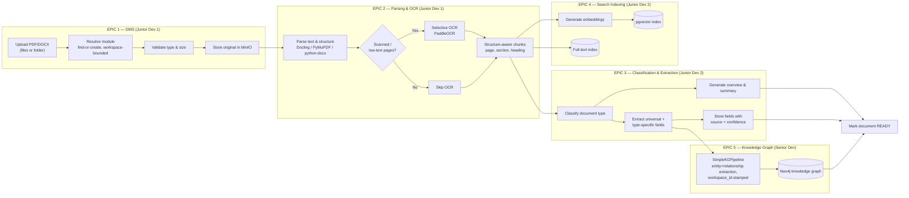
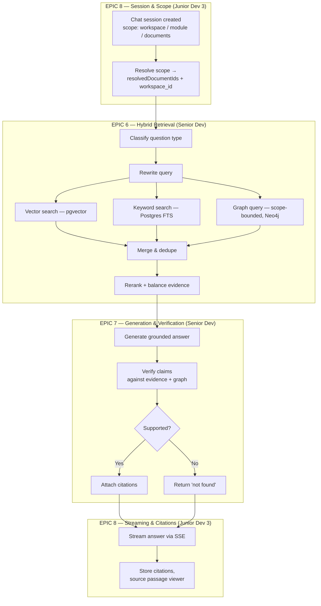
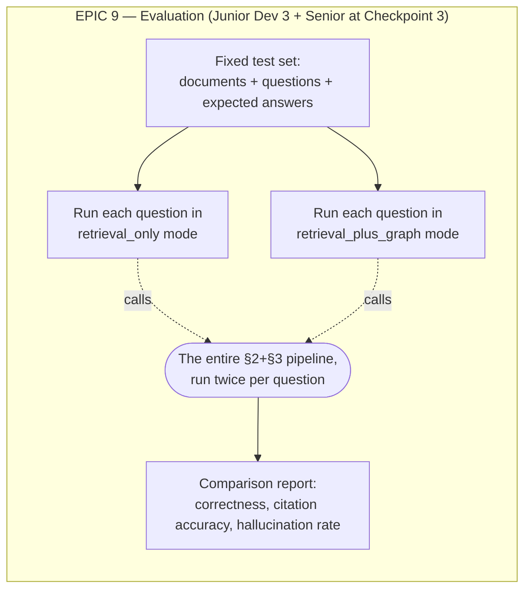

# Epic Interlinking & Architecture Map — Pod 3

> Answers one question: **where does each epic actually sit, and what exactly flows between them?** Read this alongside `03_architecture.md` (same diagrams, now labeled by epic) and `06_backend_epics_and_stories.md` (the stories themselves).

---

## 1. The one rule that makes all of this work

Every epic builds against a **fixture** that mimics its real upstream input, so it never has to wait for another epic to finish. At a scheduled checkpoint, the fixture is swapped for the real thing — a config/wiring change, not a redesign. Three checkpoints, three swaps:

| Checkpoint | Day | What gets swapped from fixture → real |
|---|---|---|
| **1** | Day 5 | Epic 2's real parsed chunks → feed Epic 3 and Epic 4 (both were using fixture chunks). Epic 3's real extracted fields → feed Epic 5 (was using fixture fields). |
| **2** | Day 8 | Epic 6's real evidence package → feeds Epic 7 (was using a fixture evidence package). Epic 7's real answer generator → feeds Epic 8's chat endpoint (was using a stub generator). |
| **3** | Day 10 | Epic 7/8's real, fully-wired pipeline → feeds Epic 9's evaluation runner (was using a stub chat response). |

---

## 2. Ingestion side — where Epics 1, 2, 3, 4, 5 sit

This is the same diagram as `03_architecture.md` §3.2, with epic ownership drawn on top so you can see the boundaries.

**Read it as:** Epic 1 hands a stored file to Epic 2. Epic 2 hands parsed chunks to **both** Epic 3 and Epic 4 at the same time (they don't depend on each other — that's why they're both owned by Junior Dev 2 and can be built in either order, or even the same day). Epic 3 hands its extracted fields to Epic 5. Nothing here waits on Epic 6, 7, or 8 — the whole left half of the pipeline is fully independent of the whole right half until Checkpoint 1 finishes.

---

## 3. Query side — where Epics 6, 7, 8 sit

Same diagram as `03_architecture.md` §4.1/§4.2, labeled by epic.

**Read it as:** Epic 8 owns both ends of this flow (session/scope creation at the start, streaming/citations at the end) but doesn't own the middle — that's why Epic 8's stories can be fully built and tested against a **stub answer generator** long before Epic 6/7 are real. The Senior Dev's two epics (6 and 7) sit entirely in the middle, consuming what Epic 8 resolved and producing what Epic 8 streams back out.

---

## 4. Where Epics 9 and 10 sit (not in either diagram above — they wrap around it)

Epic 9 doesn't sit *inside* the pipeline — it calls the whole thing (§2 ingestion already done, §3 query flow) twice per test question and diffs the results. This is why it's built against a **stub chat response** until Checkpoint 3: the harness/scoring logic (loading the test set, running two modes, comparing) is fully buildable without the real pipeline existing yet.

**Epic 10 (Hardening)** isn't a pipeline stage at all — it's cross-cutting: logging wraps every request in Epic 1 and Epic 8, audit trail wraps upload (Epic 1) and chat (Epic 8) actions specifically, and file validation lives inside Epic 1's upload story. No diagram box for it; it's a layer over the others.

---

## 5. Master input/output table — all 11 epics in one place

| Epic | Owner | Built against (fixture) | Real input comes from | Swapped at | Produces | Consumed by |
|---|---|---|---|---|---|---|
| 0. Foundation | Senior | — | — | Day 1 | Repo, DB schema, CI, auth | Everyone |
| 1. DMS | Junior 1 | — (self-contained) | Epic 0 | Day 1 | Stored file + module assignment + status | Epic 2 |
| 2. Parsing/OCR | Junior 1 | Sample fixture files | Epic 1's stored files | **Checkpoint 1** | `document_page`, `document_chunk` rows | Epic 3, Epic 4 |
| 3. Classification/Extraction | Junior 2 | Fixture parsed text | Epic 2's real chunks | **Checkpoint 1** | `extracted_field` rows, `document_type` | Epic 5 |
| 4. Search Indexing | Junior 2 | Fixture chunks | Epic 2's real chunks | **Checkpoint 1** | pgvector index, full-text index | Epic 6 |
| 5. Knowledge Graph | Senior | Fixture extracted fields | Epic 3's real fields | **Checkpoint 1** | Neo4j nodes + edges | Epic 6 |
| 6. Hybrid Retrieval | Senior | Fixture indexes + graph | Epic 4 + Epic 5's real data | **Checkpoint 2** | Ranked evidence package | Epic 7 |
| 7. Generation/Verification | Senior | Fixture evidence package | Epic 6's real evidence | **Checkpoint 2** | Grounded, verified answer | Epic 8 |
| 8. Chat API & Citations | Junior 3 | Stub answer generator | Epic 7's real generator | **Checkpoint 2** | SSE stream, citations, sessions | Frontend / user |
| 9. Evaluation | Junior 3 (+ Senior) | Stub chat response | Epic 7+8's real pipeline | **Checkpoint 3** | Accuracy comparison report | Leadership demo |
| 10. Hardening | Junior 1 | — (cross-cutting) | Epic 1 + Epic 8 endpoints | Ongoing | Logs, audit trail, validation | Ops/security |

---

## 6. The one-line version, if you only remember one thing

Ingestion flows **1 → 2 → (3 and 4 in parallel) → 5**. Query flows **8 (scope) → 6 (retrieval) → 7 (generation) → 8 (streaming)**. Evaluation (**9**) calls the whole query flow twice. Hardening (**10**) sits on top of 1 and 8. Every arrow that crosses an epic boundary is a fixture until its named checkpoint, and a real wire after it.
